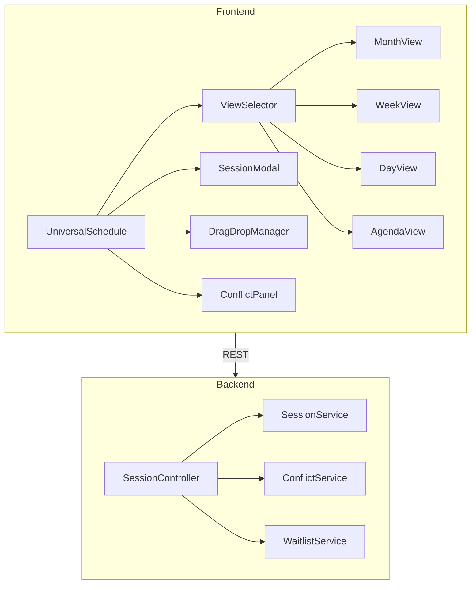

# Universal Master Schedule - MindBody Feature Parity Blueprint

**Date:** 2026-01-22
**Status:** READY FOR IMPLEMENTATION
**Theme:** Galaxy-Swan (Cyan/Purple Deep Space)
**Target:** ChatGPT Implementation

---

## Executive Summary

Upgrade the Universal Master Schedule to achieve MindBody-level functionality while maintaining the distinctive Galaxy-Swan aesthetic.

---

## 1. Feature Gap Matrix

| Feature | MindBody | Current | Priority | Phase |
|---------|----------|---------|----------|-------|
| Month View | ✅ | ❌ | P0 | 1 |
| Week View | ✅ | ✅ | - | Done |
| Day View | ✅ | ❌ | P0 | 1 |
| Agenda View | ✅ | ❌ | P0 | 1 |
| Multi-Trainer Columns | ✅ | ❌ | P0 | 1 |
| Drag-Drop Reschedule | ✅ | ❌ | P0 | 1 |
| Conflict Detection | ✅ | ❌ | P0 | 2 |
| Trainer Availability | ✅ | ❌ | P1 | 3 |
| Buffer Times | ✅ | ❌ | P1 | 4 |
| Waitlist | ✅ | ❌ | P1 | 5 |
| Cancellation Policy | ✅ | ❌ | P2 | 6 |
| Recurring Sessions | ✅ | ✅ | - | Done |
| Time Blocking | ✅ | ✅ | - | Done |
| Mobile Responsive | ✅ | Partial | P0 | 1 |

---

## 2. Galaxy-Swan Theme

```typescript
const GALAXY_SWAN = {
  background: { void: '#0a0a1a', nebula: '#1a1a2e', cosmic: '#16213e' },
  primary: { cyan: '#00FFFF', blue: '#00A0E3' },
  secondary: { purple: '#7851A9', magenta: '#9D4EDD' },
  status: { success: '#00FF88', warning: '#FFD700', error: '#FF4757' },
  glass: { surface: 'rgba(30, 30, 60, 0.4)', border: 'rgba(0, 255, 255, 0.2)' }
};
```

---

## 3. Architecture



---

## 4. New Database Tables

- TrainerAvailability (trainerId, dayOfWeek, startTime, endTime)
- WaitlistEntries (sessionId, userId, position, status, expiresAt)
- SessionTypes (name, duration, bufferBefore, bufferAfter, color)
- CancellationPolicies (name, rules JSONB)

Sessions additions: sessionTypeId, bufferBefore, bufferAfter, waitlistEnabled, cancelledAt

---

## 5. Key API Endpoints

- GET /api/sessions/calendar - Multi-view calendar data
- PUT /api/sessions/:id/reschedule - Drag-drop reschedule
- POST /api/sessions/check-conflicts - Conflict detection
- GET/PUT /api/trainers/:id/availability - Trainer schedules
- POST /api/waitlist - Join waitlist
- POST /api/sessions/:id/cancel - Cancel with policy

---

## 6. Implementation Phases

**Phase 1 (P0):** ViewSelector, MonthView, DayView, AgendaView
**Phase 2 (P0):** DragDropManager, ConflictService, ConflictPanel
**Phase 3 (P1):** TrainerAvailability, multi-trainer columns
**Phase 4 (P1):** SessionTypes, buffer times
**Phase 5 (P1):** Waitlist system
**Phase 6 (P2):** Cancellation policies

---

## 7. Frontend Dependencies

- @dnd-kit/core, @dnd-kit/sortable
- date-fns, rrule
- zustand, @tanstack/react-query

---

## 8. Success Metrics

- Mobile booking < 30 seconds
- Zero double bookings
- View switching < 200ms
- Drag-drop success > 95%

---

**Ready for ChatGPT Implementation** ✅
