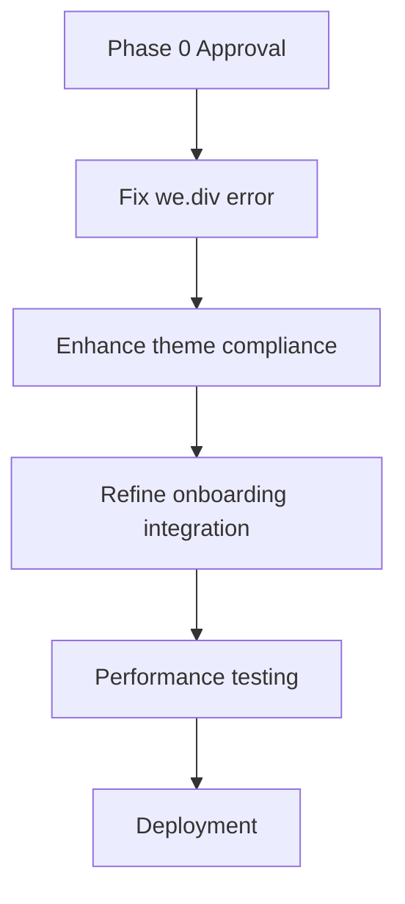

# Phase 0 Design Review: Dashboard Architecture Analysis

## Overview
**Purpose:** Comprehensive review of admin, client, and trainer dashboard architecture  
**Current Status:** 80-90% implemented, needs consolidation and theme compliance  
**Reviewers Required:** 5 (Claude Code, Roo Code, ChatGPT-5, Claude Desktop, Gemini)  

## Current Architecture Analysis

### UnifiedAdminDashboardLayout.tsx (881 lines)
- ✅ Centralized routing and layout management  
- ✅ Proper admin access verification  
- ✅ Theme integration with Galaxy-Swan standards  
- ⚠️ Potential issue: `we.div` error in production build  
- ⚠️ ClientOnboardingWizard integration needs refinement  

### admin-dashboard-view.tsx (1035 lines)
- ✅ Comprehensive metrics and system monitoring  
- ✅ Responsive design implementation  
- ⚠️ Recharts dependency temporarily disabled  
- ⚠️ Needs stronger Galaxy-Swan theme integration  

## Design Compliance Checklist

### Galaxy-Swan Theme Requirements
- [x] Galaxy core gradient + starfield background  
- [ ] Glass surfaces with gradient borders (partial)  
- [x] Cosmic micro-interactions  
- [ ] Swan motifs (missing in admin dashboard)  

## Proposed Improvements

1. **Client Onboarding Integration**
- Move from `/onboarding/client` to `/dashboard/client-onboarding`  
- Ensure proper admin context and permissions  

2. **Theme Compliance**
- Enhance glass surfaces and gradient borders  
- Add swan motifs to admin interface  

3. **Performance Optimization**
- Address `we.div` production error  
- Restore Recharts with proper lazy loading  

## Implementation Plan

## Review Questions for AI Village

1. Does the current architecture support all required admin functions?  
2. Are there any security concerns with the dashboard implementation?  
3. How can we better integrate the Galaxy-Swan theme?  

---
**Reviewers:** Please append your feedback below using the Unified Review Prompt format