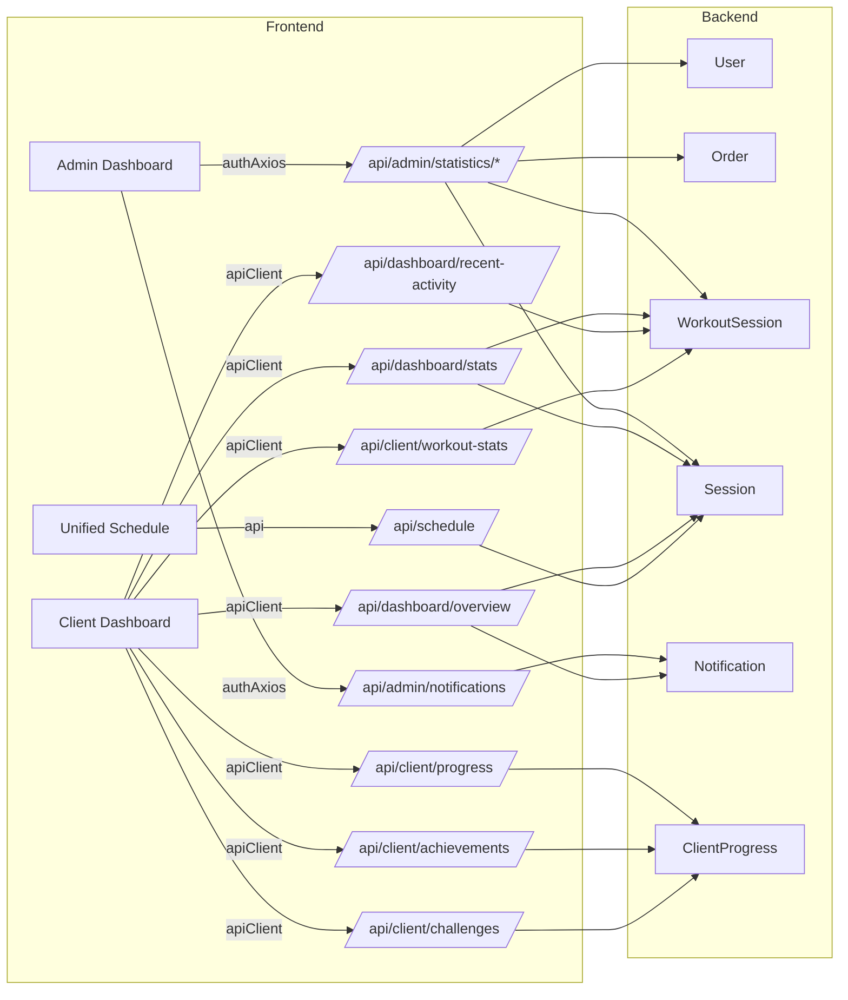
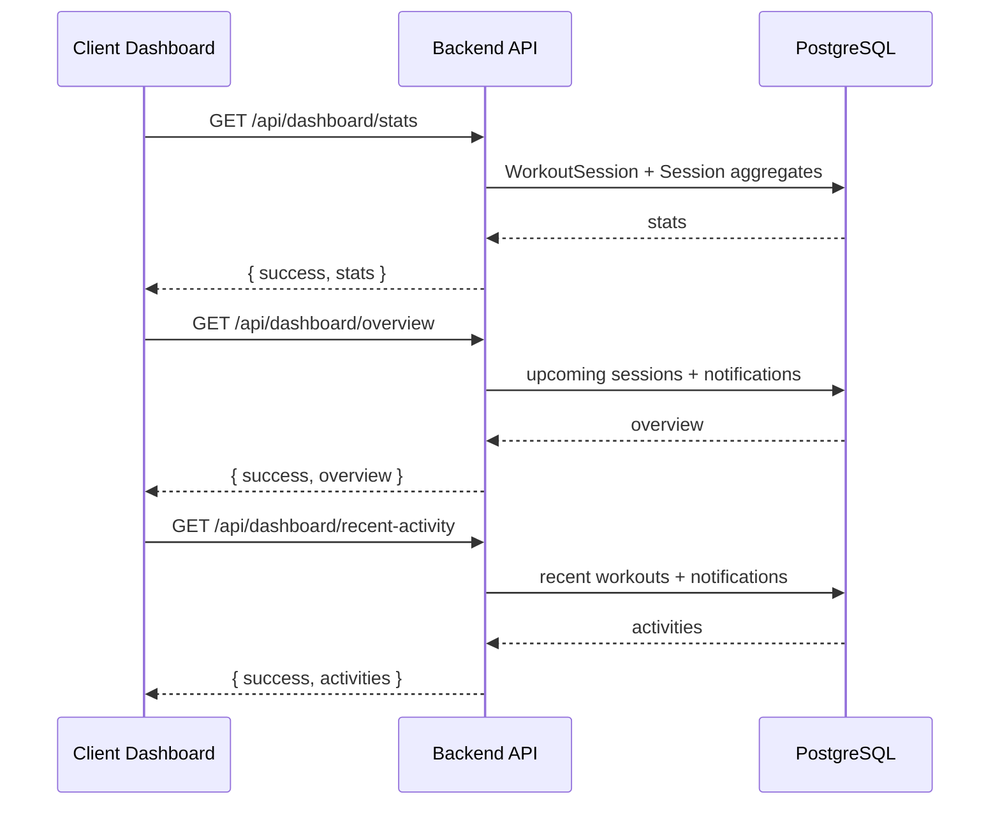
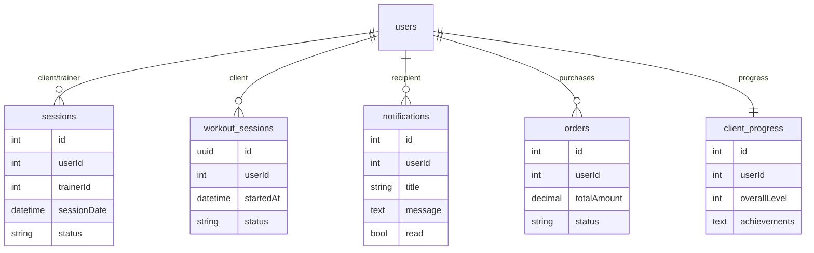

# Phase 0 Design Review: Dashboard Architecture Analysis

## Overview
Purpose: Unified review of admin, client, and trainer dashboard architecture and the Phase 2 backend integration plan.
Status: Active - updated for Option 3 (tab/badge sync) and Option 4 (backend integration).
References:
- docs/ai-workflow/AI-HANDOFF/CURRENT-TASK.md
- DASHBOARD-DEEP-ANALYSIS-AUDIT-REPORT.md
- DASHBOARD-TAB-ORGANIZATION-VISUAL.md (wireframes + tab map)

## Scope
Files in scope for this phase:
- frontend/src/components/DashBoard/Pages/admin-dashboard/admin-dashboard-view.tsx
- frontend/src/components/DashBoard/UnifiedAdminDashboardLayout.tsx
- frontend/src/components/ClientDashboard/StellarSidebar.tsx
- frontend/src/components/TrainerDashboard/StellarComponents/TrainerStellarSidebar.tsx
- backend/routes/dashboardRoutes.mjs
- backend/routes/dashboardStatsRoutes.mjs
- backend/controllers/scheduleController.mjs
- backend/routes/adminAnalyticsRoutes.mjs (alias endpoints)
- backend/services/trainerAssignmentService.mjs (assignment stats fix)
- backend/routes/adminNotificationsRoutes.mjs (new)
- backend/routes/clientDashboardRoutes.mjs (new)

## Architecture Overview

## Data Flow (Client Dashboard)

## Database ERD (Dashboard Metrics)

## API Specs (Phase 2 Integration)

### Admin Statistics (new aliases)
- GET /api/admin/statistics/revenue
- GET /api/admin/statistics/users
- GET /api/admin/statistics/workouts
- GET /api/admin/statistics/system-health

### Dashboard
- GET /api/dashboard/stats
- GET /api/dashboard/overview
- GET /api/dashboard/recent-activity

### Client
- GET /api/client/progress
- GET /api/client/achievements
- GET /api/client/challenges
- GET /api/client/workout-stats

### Schedule
- GET /api/schedule (start/end optional; defaults to rolling window)

### Admin Notifications
- GET /api/admin/notifications
- DELETE /api/admin/notifications/:id
- POST /api/admin/notifications/broadcast

## WHY Sections
- WHY add /api/admin/statistics/* aliases?
  - Frontend integration expects these paths from the audit report.
  - Aliases allow reuse of existing analytics logic without breaking current clients.

- WHY allow optional start/end on /api/schedule?
  - Client dashboard service currently fetches without date range; defaults prevent 400 errors.

- WHY standardize dashboard stats endpoints?
  - Eliminates mixed mock/real data and removes dual-state UX confusion.

- WHY add status badges on client/trainer sidebars?
  - Makes incomplete or mock sections visible to avoid user confusion.

## Split Strategy (Non-Monolith Compliance)
Target: keep components <= 300 lines.

1) admin-dashboard-view.tsx
- Move overview logic to: frontend/src/components/DashBoard/Pages/admin-dashboard/overview/AdminOverviewPanel.tsx
- Move styled components to: frontend/src/components/DashBoard/Pages/admin-dashboard/overview/AdminOverview.styles.ts
- Keep admin-dashboard-view.tsx as layout + section routing only

2) UnifiedAdminDashboardLayout.tsx
- Move route config to: frontend/src/components/DashBoard/AdminRouteConfig.tsx
- Move layout shell to: frontend/src/components/DashBoard/AdminLayoutShell.tsx

3) Client StellarSidebar
- Move styled components to: frontend/src/components/ClientDashboard/StellarSidebar.styles.ts
- Move navigation config + status meta to: frontend/src/components/ClientDashboard/StellarSidebar.config.ts

4) Trainer StellarSidebar
- Move styled components to: frontend/src/components/TrainerDashboard/StellarComponents/TrainerStellarSidebar.styles.ts
- Move navigation config + status meta to: frontend/src/components/TrainerDashboard/StellarComponents/TrainerStellarSidebar.config.ts

## Notes
- Use models cache for new routes (import { getAllModels, getModel, Op } from backend/models/index.mjs).
- Do not introduce new mock data. If no records exist, return empty arrays with success.
- Keep current UI structure; update data sources only.

## Review Questions
1) Do endpoints cover all dashboard data needed for 2026 revenue readiness?
2) Any remaining mock data sources after this phase?
3) Any performance hotspots in dashboard aggregates?
