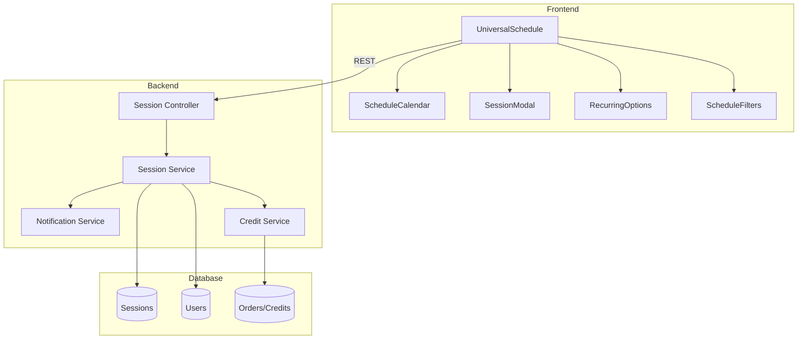
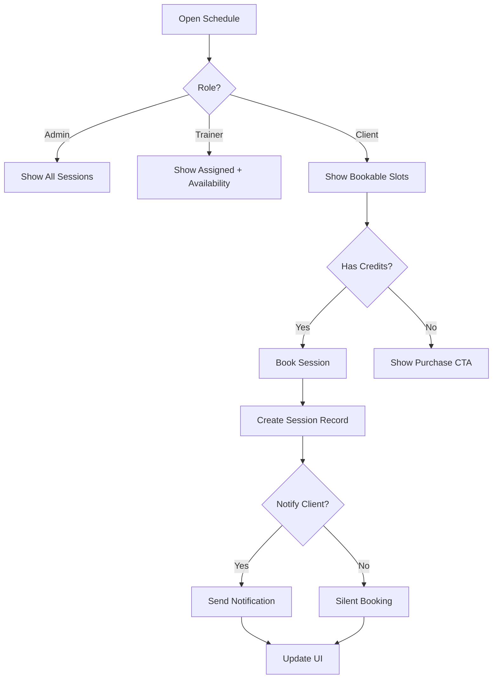

# Universal Schedule Architecture - Phase 0 Design Review

**Date Started:** 2026-01-17
**Status:** IN REVIEW
**Priority:** HIGH
**Owner:** AI Village

---

## Quick Links

- Registry: [PHASE-0-REGISTRY.md](../PHASE-0-REGISTRY.md)
- Prompts: [AI-ROLE-PROMPTS.md](../AI-ROLE-PROMPTS.md)
- Process Guide: [PHASE-0-DESIGN-APPROVAL.md](../PHASE-0-DESIGN-APPROVAL.md)

---

## 1. Context & Background

**Current Situation:**
- Scheduling is split across AdminScheduleTab, TrainerScheduleTab, and ClientScheduleTab.
- Mobile experience is inconsistent and recurring sessions are missing.
- Features differ by role, causing gaps and support load.

**Business Requirements:**
- MindBody parity: recurring sessions, time blocking, notification toggles.
- One calendar with role-based views and permissions.
- Mobile-first usability on phone and tablet.
- Store is the source of truth for credits and session limits.

**Reference Docs:**
- docs/systems/UNIVERSAL-MASTER-SCHEDULE-HANDBOOK.md (business logic source of truth)
- docs/ai-workflow/AI-HANDOFF/CURRENT-TASK.md (priority tracking)

---

## 2. Design Artifacts

### A. Architecture Diagram (Mermaid)



### B. ERD (ASCII)

```
Users (id, role, ...)
   1 --- n
Sessions (id, sessionDate, duration, status, userId, trainerId,
         isRecurring, recurringGroupId, recurrenceRule, notifyClient, isBlocked)
```

### C. Flowchart (Mermaid)



### D. Wireframe/Mockup (ASCII)

```
+------------------------------------------------------------+
| Universal Schedule (Month/Week/Day/Agenda)                 |
+----------------------+----------------------+--------------+
| Filters              | Calendar             | Details      |
| - Trainer            | [Calendar Grid]      | Session Card |
| - Location           |                      | - Status     |
| - Type               |                      | - Actions    |
+----------------------+----------------------+--------------+
| Mobile: Agenda list with "Book" and "Block" actions        |
+------------------------------------------------------------+
```

### E. Visual Design Specs

- Colors: Galaxy core background, cyan/purple accents, glass surfaces.
- Typography: Display serif for headings, sans serif for body.
- Motion: 120-180ms hover/selection transitions.

### F. User Stories

```
As an admin,
I want to create and edit recurring sessions,
So that I can manage schedules at scale.

As a trainer,
I want to block out time,
So that I can prevent booking conflicts.

As a client,
I want to book sessions on mobile,
So that I can schedule quickly without calling.
```

**Acceptance Criteria:**
- [ ] Admin can create a recurring series with an RRule string.
- [ ] Trainer can block time and it shows as unavailable.
- [ ] Client cannot book with zero credits.
- [ ] All roles can use the schedule on mobile.

### G. API Specification (Draft)

```yaml
GET /api/sessions?from=2026-01-01&to=2026-01-31

POST /api/sessions
Body: { sessionDate, duration, trainerId, userId, status, notifyClient }

POST /api/sessions/recurring
Body:
  startDate: "2026-01-20T10:00:00Z"
  duration: 60
  trainerId: 5
  userId: 12
  recurrenceRule: "FREQ=WEEKLY;INTERVAL=1;COUNT=10"
  notifyClient: true

POST /api/sessions/:id/book
POST /api/sessions/:id/complete
POST /api/sessions/:id/block
DELETE /api/sessions/:id
```

### H. Database Schema (Session Additions)

```sql
ALTER TABLE "Sessions" ADD COLUMN "isRecurring" BOOLEAN DEFAULT false;
ALTER TABLE "Sessions" ADD COLUMN "recurringGroupId" UUID NULL;
ALTER TABLE "Sessions" ADD COLUMN "recurrenceRule" TEXT NULL; -- RFC 5545
ALTER TABLE "Sessions" ADD COLUMN "notifyClient" BOOLEAN DEFAULT true;
ALTER TABLE "Sessions" ADD COLUMN "isBlocked" BOOLEAN DEFAULT false;
```

### I. Component Structure (Frontend)

```
frontend/src/components/Schedule/
|-- UniversalSchedule.tsx
|-- ScheduleCalendar.tsx
|-- SessionModal.tsx
|-- RecurringOptions.tsx
`-- ScheduleFilters.tsx
```

---

## 3. Technical Requirements

**Galaxy-Swan Theme Compliance:**
- [ ] Galaxy core gradient + starfield background
- [ ] Glass surfaces with gradient borders
- [ ] Micro-interactions within 120-180ms
- [ ] Display serif for H1/H2
- [ ] Swan motifs in key UI accents

**Performance:**
- [ ] Fetch sessions by date range (month window).
- [ ] Debounce filter changes.
- [ ] Avoid rerenders on drag and drop.

**Accessibility:**
- [ ] Keyboard navigation for calendar grid.
- [ ] ARIA labels for slots and events.
- [ ] Reduced motion support.

**Security:**
- [ ] RBAC on all endpoints.
- [ ] Input validation and conflict checks.
- [ ] Rate limit booking endpoints.

---

## 4. Business Logic (WHY)

- WHY use recurrenceRule?
  - Standard RFC 5545 format supports complex patterns and future calendar sync.
- WHY store notifyClient on session?
  - Allows per-action opt-out without changing global preferences.
- WHY use isBlocked?
  - Prevents overloading availability by separating blocked time from sessions.
- WHY a single UniversalSchedule?
  - Ensures parity across roles and reduces maintenance.

---

## 5. Edge Cases

1. Double booking (same trainer, same time): reject with 409.
2. Client has zero credits: block booking and prompt store CTA.
3. Cancel within 24 hours: do not refund unless admin override.
4. Edit recurring series: choose "this event" or "all events".
5. Timezone mismatch: store UTC, display local time.

---

## 6. Out of Scope (Phase 2)

- Waitlist.
- Late cancel fees.
- External calendar sync (Google/Outlook).

---

## 7. Success Metrics

- Mobile booking flow under 30 seconds.
- Zero double bookings in production.
- 100 percent of scheduling flows migrated to UniversalSchedule.

---

## 8. AI Reviews (APPEND ONLY)

### Claude Code (Integration)
**Date:** 2026-01-17 00:00
**Verdict:** PENDING

[Review content]

---

### Roo Code (Backend)
**Date:** 2026-01-17 00:00
**Verdict:** PENDING

[Review content]

---

### ChatGPT-5 (QA)
**Date:** 2026-01-17 00:00
**Verdict:** PENDING

[Review content]

---

### Claude Desktop (Orchestrator and Security)
**Date:** 2026-01-17 00:00
**Verdict:** PENDING

[Review content]

---

### Gemini Code Assist (Frontend)
**Date:** 2026-01-17 00:00
**Verdict:** PENDING

[Review content]

---

## 9. Resolution Log

**Issue #1:** [Description]
- **Raised by:** [AI name]
- **Severity:** CONCERN / BLOCKER
- **Resolution:** [What was changed]
- **Status:** RESOLVED / IN PROGRESS

---

## 10. Consensus Summary

**Status:** PENDING / CONSENSUS REACHED / BLOCKED

**Approvals:** [X/5]
- Claude Code: [APPROVED/CONCERNS/BLOCKED/PENDING]
- Roo Code: [APPROVED/CONCERNS/BLOCKED/PENDING]
- ChatGPT-5: [APPROVED/CONCERNS/BLOCKED/PENDING]
- Claude Desktop: [APPROVED/CONCERNS/BLOCKED/PENDING]
- Gemini: [APPROVED/CONCERNS/BLOCKED/PENDING]

**Issues Resolved:** [X/X] (100%)

**Final Consensus Date:** [YYYY-MM-DD]

**Next Step:** Move to Phase 1-7 implementation via `docs/ai-workflow/FEATURE-TEMPLATE.md`.

**Implementation Branch:** `feature/universal-schedule`

---

**File Size:** Keep this file focused. If it exceeds 800 lines, consider splitting artifacts into separate docs.
