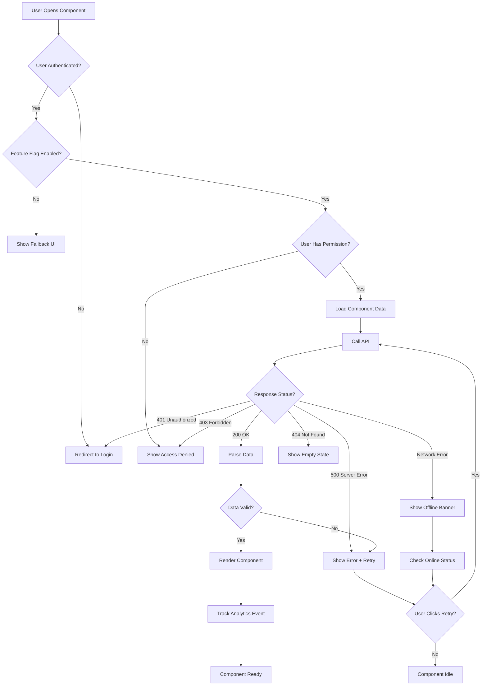
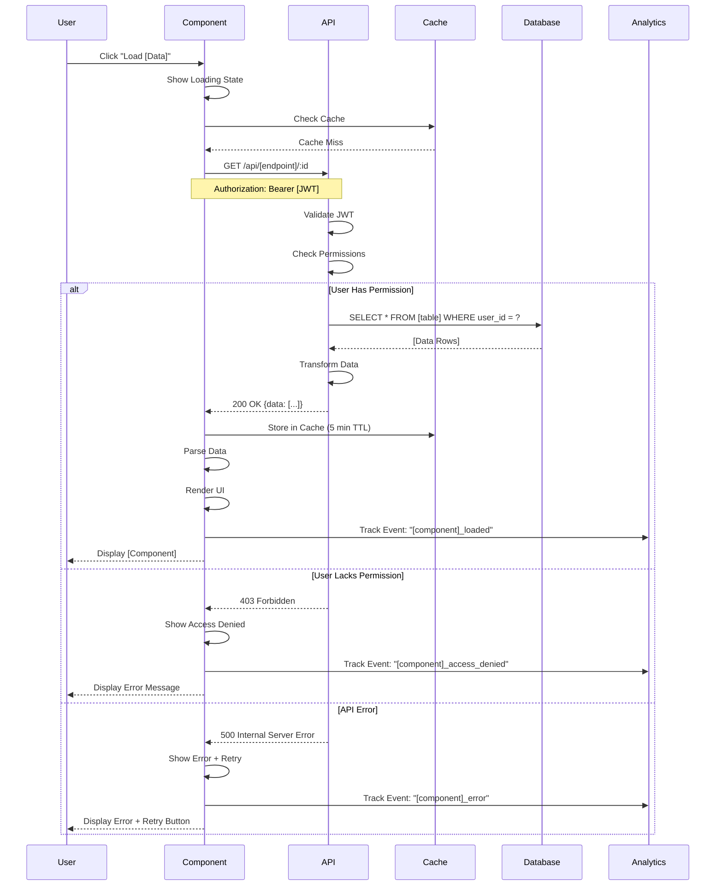
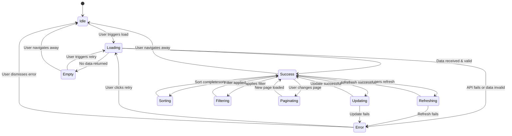
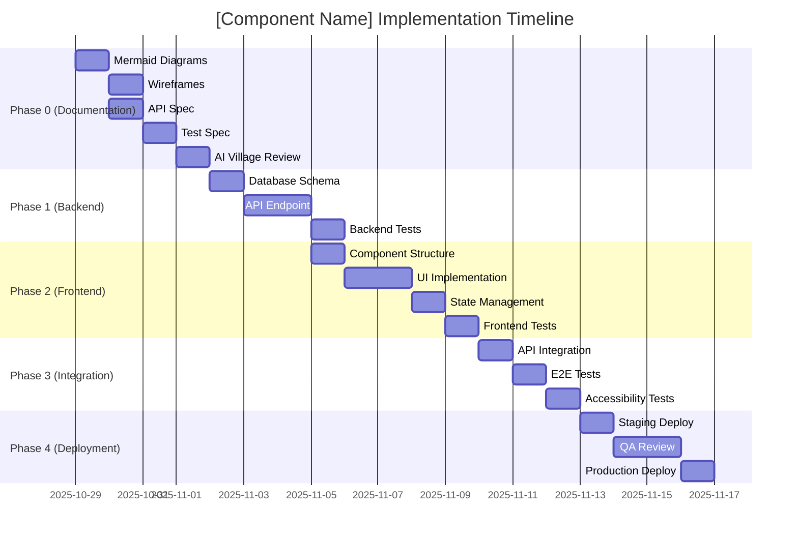

# [Component Name] - Mermaid Diagrams

**Component:** [Component Name]
**Created:** [Date]
**Last Updated:** [Date]
**Assigned To:** Roo Code (sequence diagrams), Gemini (state diagrams), Claude Code (flowcharts)

---

## 📋 OVERVIEW

This file contains all Mermaid diagrams for [Component Name]:
1. **Flowchart:** User interactions and decision points
2. **Sequence Diagram:** API calls and data flow
3. **State Diagram:** Component states and transitions
4. **Gantt Chart:** Implementation timeline (if applicable)

---

## 1. FLOWCHART: User Interactions & Decision Points

**Purpose:** Show how users interact with the component and what decisions are made at each step.

**Key Decision Points:**
1. **Authentication Check:** Ensures user is logged in before showing component
2. **Feature Flag Check:** Allows gradual rollout and quick rollback
3. **Permission Check:** Enforces role-based access control (RBAC)
4. **Response Status:** Handles all HTTP status codes gracefully
5. **Data Validation:** Prevents rendering invalid/malformed data

**Edge Cases Handled:**
- User logs out while component is active → Redirect to login
- API rate limited (429) → Show "Too many requests" message + exponential backoff
- Invalid JSON response → Show error + log to Sentry
- User dismisses error without retry → Component remains in error state

---

## 2. SEQUENCE DIAGRAM: API Calls & Data Flow

**Purpose:** Show the exact sequence of API calls, database queries, and data transformations.

**API Specifications:**
- **Endpoint:** `GET /api/[endpoint]/:id`
- **Headers:** `Authorization: Bearer [JWT]`, `Content-Type: application/json`
- **Query Params:** `?filter=[value]&sort=[field]&limit=10`
- **Response Format:** `{ data: [...], pagination: {...}, meta: {...} }`
- **Error Format:** `{ error: "Error message", code: "ERROR_CODE", details: {...} }`

**Caching Strategy:**
- **Cache Key:** `[component]:[userId]:[params]`
- **TTL:** 5 minutes
- **Invalidation:** On data mutation (POST/PUT/DELETE)
- **Storage:** LocalStorage (client-side) or Redis (server-side)

**Performance Requirements:**
- **API Response Time:** <500ms (p95)
- **Component Load Time:** <2s (including API call)
- **Cache Hit Rate:** >80%

---

## 3. STATE DIAGRAM: Component States & Transitions

**Purpose:** Define all possible states the component can be in and how it transitions between states.

**State Definitions:**

| State | Description | UI Appearance | Actions Available |
|-------|-------------|---------------|-------------------|
| **Idle** | Component mounted but no data loaded | Placeholder or previous data | Load, Navigate away |
| **Loading** | Fetching data from API | Skeleton UI, spinner | Cancel (if supported) |
| **Success** | Data loaded and displayed | Full UI with data | Refresh, Edit, Sort, Filter, Paginate |
| **Empty** | No data available | "No data yet" message + CTA | Retry, Navigate away |
| **Error** | API call failed or data invalid | Error banner + retry button | Retry, Dismiss, Navigate away |
| **Refreshing** | Reloading existing data | Spinner overlay on existing data | Cancel |
| **Updating** | Saving edited data | Disabled form, spinner on save button | Cancel |
| **Sorting** | Reordering data | Loading indicator on header | None (brief transition) |
| **Filtering** | Applying filter criteria | Loading indicator on filter UI | None (brief transition) |
| **Paginating** | Loading new page of data | Loading indicator on pagination | None (brief transition) |

**State Persistence:**
- **URL State:** Current page, sort order, filters (shareable URL)
- **LocalStorage:** User preferences (collapsed sections, column widths)
- **Session State:** Scroll position, selected items

---

## 4. GANTT CHART: Implementation Timeline (Optional)

**Purpose:** Show implementation order and dependencies.

**Dependencies:**
- Backend must be completed before frontend API integration
- Tests must pass before deployment
- Documentation must be approved before implementation begins

**Critical Path:**
- Phase 0 → Phase 1 → Phase 2 → Phase 3 → Phase 4
- Total Timeline: 15-20 days (depending on complexity)

---

## 🚨 EDGE CASES & ERROR HANDLING

### **Network Errors:**
- **Timeout (>30s):** Show "Request timed out" + retry
- **No Internet:** Show offline banner, queue requests for later
- **CORS Error:** Log to Sentry, show generic error (dev issue, not user-facing)

### **Authentication Errors:**
- **Token Expired:** Refresh token automatically, retry request
- **Invalid Token:** Redirect to login
- **No Token:** Redirect to login

### **Data Validation Errors:**
- **Invalid JSON:** Show error, log to Sentry
- **Missing Required Fields:** Show error, log schema mismatch
- **Type Mismatch:** Show error, log to Sentry

### **Rate Limiting:**
- **429 Too Many Requests:** Show "Too many requests, please wait [X] seconds" + exponential backoff

---

## ✅ AI REVIEW CHECKLIST

**Before marking this file as complete, verify:**

- [ ] All decision points are documented in flowchart
- [ ] All API calls are shown in sequence diagram
- [ ] All component states are defined in state diagram
- [ ] All state transitions are documented
- [ ] All edge cases are covered
- [ ] All error handling paths are shown
- [ ] All performance requirements are specified
- [ ] All security considerations are documented (auth, permissions)
- [ ] Gantt chart shows realistic timeline (if applicable)

**Assigned AI:** [AI Name]
**Review Status:** [ ] In Progress [ ] Complete [ ] Needs Revision
**Completion Date:** [Date]

---

## 📝 NOTES

[Any additional notes, assumptions, or clarifications]
