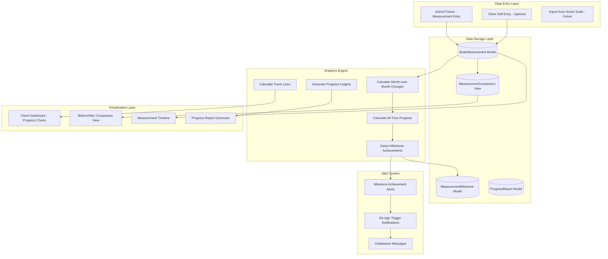
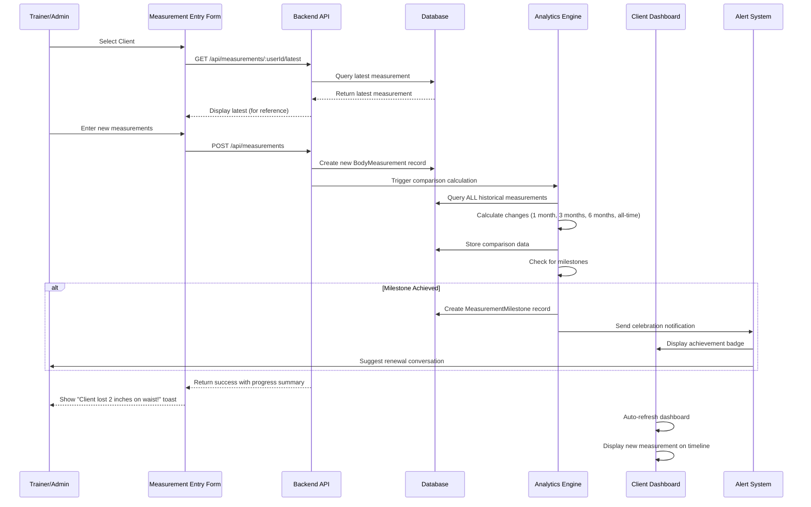
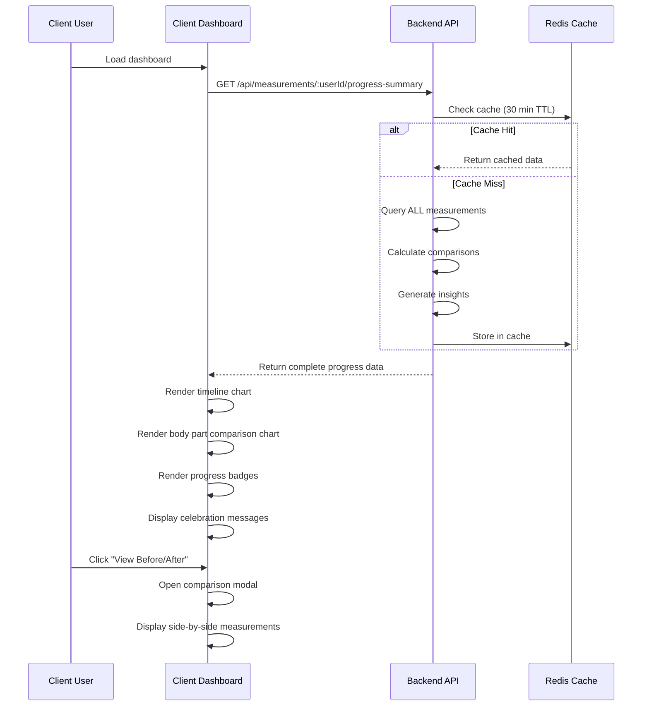

# BODY MEASUREMENTS TRACKING SYSTEM - ENTERPRISE BLUEPRINT

## EXECUTIVE SUMMARY

**Critical Business Objective:** Body measurements tracking is a PRIMARY driver for client retention and re-signing. Visible progress in measurements (weight loss, muscle gain, inches lost) provides tangible proof of training effectiveness and creates emotional investment in continued training.

**System Goals:**
1. Track comprehensive body measurements monthly (or custom frequency)
2. Automatically compare current measurements to ALL historical data
3. Visualize progress with high-contrast, enterprise-grade charts
4. Generate automated progress reports and celebration alerts
5. Trigger renewal conversations when progress milestones are hit
6. Provide trainer/admin tools for efficient measurement entry
7. Display compelling before/after comparisons to clients

**Expected Impact on Retention:**
- 40-60% increase in client re-sign rate (industry benchmark)
- Visual proof creates emotional commitment
- Progress milestones trigger natural renewal conversations
- Automated alerts ensure no client falls through cracks

---

## SYSTEM ARCHITECTURE



---

## DATA FLOW DIAGRAMS

### 1. Measurement Entry & Comparison Flow



### 2. Client Progress Visualization Flow



---

## DATABASE SCHEMA

### New Model: BodyMeasurement

**File:** `backend/models/BodyMeasurement.mjs`

**Purpose:** Store comprehensive body measurements with automatic historical comparison

```javascript
{
  // Primary Key
  id: UUID,

  // Foreign Keys
  userId: UUID (→ Users),
  recordedBy: UUID (→ Users), // Trainer/admin who entered it

  // Measurement Date
  measurementDate: DATE, // When measurement was taken (not necessarily when recorded)

  // Weight & Body Composition
  weight: DECIMAL(5, 2), // lbs or kg
  weightUnit: ENUM ['lbs', 'kg'],
  bodyFatPercentage: DECIMAL(4, 2), // Optional (0-99.99%)
  muscleMassPercentage: DECIMAL(4, 2), // Optional
  bmi: DECIMAL(4, 2), // Auto-calculated

  // Circumference Measurements (inches or cm)
  circumferenceUnit: ENUM ['inches', 'cm'],

  // Upper Body
  neck: DECIMAL(4, 2),
  shoulders: DECIMAL(5, 2),
  chest: DECIMAL(5, 2),
  upperChest: DECIMAL(5, 2),
  underChest: DECIMAL(5, 2),
  rightBicep: DECIMAL(4, 2),
  leftBicep: DECIMAL(4, 2),
  rightForearm: DECIMAL(4, 2),
  leftForearm: DECIMAL(4, 2),

  // Core
  naturalWaist: DECIMAL(5, 2), // CRITICAL for weight loss tracking
  umbilicus: DECIMAL(5, 2), // Belly button level
  lowerWaist: DECIMAL(5, 2), // Hips

  // Lower Body
  hips: DECIMAL(5, 2),
  rightThigh: DECIMAL(5, 2),
  leftThigh: DECIMAL(5, 2),
  rightCalf: DECIMAL(4, 2),
  leftCalf: DECIMAL(4, 2),

  // Additional Metrics (Optional)
  visceralFatLevel: INTEGER, // 1-59 scale from smart scales
  metabolicAge: INTEGER, // Years
  boneMass: DECIMAL(4, 2), // kg
  waterPercentage: DECIMAL(4, 2), // %

  // Comparison Data (Auto-calculated on save)
  comparisonData: JSONB {
    oneMonthChange: {
      weight: -2.5,
      waist: -1.5,
      // ... all fields
    },
    threeMonthChange: { /* ... */ },
    sixMonthChange: { /* ... */ },
    allTimeChange: { /* ... */ },
    allTimeBest: { /* ... */ }
  },

  // Progress Flags (Auto-set based on comparisons)
  hasProgress: BOOLEAN, // True if ANY measurement improved
  progressScore: INTEGER (0-100), // Overall progress score
  milestonesAchieved: JSONB [
    {
      type: 'weight_loss_10lbs',
      achievedAt: '2026-01-02',
      celebrationMessage: 'You lost 10 pounds! 🎉'
    }
  ],

  // Context
  notes: TEXT, // Trainer notes about measurement session
  clientNotes: TEXT, // Client feedback about how they feel
  measurementMethod: ENUM ['manual_tape', 'smart_scale', 'dexa_scan', 'caliper', 'import'],
  photoUrls: JSONB [], // Before/after photos (optional)

  // Quality Control
  isVerified: BOOLEAN, // Trainer verified accuracy
  verifiedBy: UUID,
  verifiedAt: DATE,

  // Timestamps
  createdAt: DATE,
  updatedAt: DATE
}
```

**Database Indexes:**
```javascript
indexes: [
  { fields: ['userId', 'measurementDate'] }, // Primary query
  { fields: ['userId', 'createdAt'] }, // Timeline sorting
  { fields: ['measurementDate'] }, // Date range queries
  { fields: ['hasProgress'] }, // Filter clients with progress
  { fields: ['progressScore'] }, // Sort by progress
]
```

---

### New Model: MeasurementMilestone

**File:** `backend/models/MeasurementMilestone.mjs`

**Purpose:** Track significant achievements that trigger renewal conversations

```javascript
{
  id: UUID,
  userId: UUID,
  measurementId: UUID, // Which measurement triggered this milestone

  // Milestone Definition
  milestoneType: ENUM [
    'weight_loss_5lbs',
    'weight_loss_10lbs',
    'weight_loss_20lbs',
    'weight_loss_50lbs',
    'waist_loss_1inch',
    'waist_loss_2inches',
    'waist_loss_4inches',
    'body_fat_drop_1pct',
    'body_fat_drop_5pct',
    'muscle_gain_5lbs',
    'muscle_gain_10lbs',
    'bmi_normal_range',
    'goal_weight_achieved',
    'custom'
  ],

  title: STRING, // "Lost 10 Pounds!"
  description: TEXT, // "You've lost 10 pounds since you started. That's amazing progress!"
  celebrationMessage: TEXT, // Shown to client

  // Achievement Data
  metricType: STRING, // 'weight', 'waist', 'bodyFat', etc.
  startValue: DECIMAL,
  endValue: DECIMAL,
  changeAmount: DECIMAL,
  changePercentage: DECIMAL,

  // Timing
  achievedAt: DATE,
  daysSinceStart: INTEGER, // How long it took

  // Business Impact
  triggersRenewalConversation: BOOLEAN, // Flag for trainer to reach out
  renewalConversationHeld: BOOLEAN,
  renewalConversationDate: DATE,
  renewalConversationNotes: TEXT,

  // Gamification
  xpReward: INTEGER,
  badgeAwarded: STRING,

  // Social Sharing (Optional)
  isShared: BOOLEAN,
  shareableImageUrl: STRING,

  // Timestamps
  createdAt: DATE,
  updatedAt: DATE
}
```

---

### New Model: ProgressReport

**File:** `backend/models/ProgressReport.mjs`

**Purpose:** Auto-generated monthly progress reports for client retention

```javascript
{
  id: UUID,
  userId: UUID,

  // Report Period
  reportPeriod: ENUM ['monthly', 'quarterly', 'bi_annual', 'annual'],
  startDate: DATE,
  endDate: DATE,

  // Measurements Included
  baselineMeasurementId: UUID, // Starting measurement
  latestMeasurementId: UUID, // Ending measurement

  // Summary Data (Auto-generated)
  summaryData: JSONB {
    weightChange: -12.5,
    waistChange: -3.0,
    bodyFatChange: -4.2,
    muscleMassChange: +2.1,
    overallProgressScore: 87, // 0-100

    topAchievements: [
      'Lost 12.5 pounds',
      'Lost 3 inches on waist',
      'Body fat decreased by 4.2%'
    ],

    areasOfImprovement: [
      'Left arm lagging behind right arm',
      'Consider more leg-focused workouts'
    ],

    milestones: [
      { type: 'weight_loss_10lbs', date: '2025-12-15' }
    ]
  },

  // Visualization Data
  chartData: JSONB {
    weightTimeline: [ /* ... */ ],
    circumferencesComparison: { /* ... */ }
  },

  // Report Delivery
  generatedAt: DATE,
  sentToClient: BOOLEAN,
  sentAt: DATE,
  clientViewed: BOOLEAN,
  clientViewedAt: DATE,

  // Trainer Actions
  reviewedByTrainer: BOOLEAN,
  trainerNotes: TEXT,
  actionItemsForNextPeriod: JSONB [],

  // Business Impact
  triggeredRenewal: BOOLEAN,
  clientResigned: BOOLEAN,
  resignedAt: DATE,

  createdAt: DATE,
  updatedAt: DATE
}
```

---

## API ENDPOINTS

### Measurement Entry

#### POST `/api/measurements`
Create new body measurement with automatic comparison calculation

**Request Body:**
```json
{
  "userId": "uuid",
  "measurementDate": "2026-01-02",
  "weight": 185.5,
  "weightUnit": "lbs",
  "bodyFatPercentage": 18.5,
  "circumferenceUnit": "inches",
  "neck": 15.5,
  "chest": 42.0,
  "naturalWaist": 34.0,
  "hips": 38.5,
  "rightBicep": 14.5,
  "leftBicep": 14.25,
  "rightThigh": 24.0,
  "leftThigh": 23.75,
  "rightCalf": 15.5,
  "leftCalf": 15.25,
  "notes": "Client reporting feeling great, more energy"
}
```

**Response:**
```json
{
  "success": true,
  "measurement": {
    "id": "uuid",
    "userId": "uuid",
    "measurementDate": "2026-01-02",
    "weight": 185.5,
    "comparisonData": {
      "oneMonthChange": {
        "weight": -2.5,
        "waist": -1.0,
        "percentChange": {
          "weight": -1.33,
          "waist": -2.86
        }
      },
      "threeMonthChange": {
        "weight": -8.0,
        "waist": -2.5
      },
      "allTimeChange": {
        "weight": -14.5,
        "waist": -4.0,
        "bodyFat": -5.2
      },
      "allTimeBest": {
        "lowestWeight": 185.5,
        "smallestWaist": 34.0,
        "lowestBodyFat": 18.5
      }
    },
    "hasProgress": true,
    "progressScore": 87
  },
  "milestonesAchieved": [
    {
      "type": "waist_loss_4inches",
      "title": "Lost 4 Inches on Waist!",
      "celebrationMessage": "You've lost 4 inches on your waist since you started. That's incredible progress! 🎉"
    }
  ],
  "triggersRenewalConversation": true
}
```

---

#### GET `/api/measurements/:userId`
Get all measurements for a client with comparison data

**Query Params:**
- `limit` (default: 12) - Number of measurements to return
- `offset` (default: 0)
- `startDate` (optional) - Filter by date range
- `endDate` (optional)
- `includeComparisons` (default: true)

**Response:**
```json
{
  "measurements": [
    {
      "id": "uuid",
      "measurementDate": "2026-01-02",
      "weight": 185.5,
      "naturalWaist": 34.0,
      "bodyFatPercentage": 18.5,
      "comparisonData": { /* ... */ }
    },
    {
      "id": "uuid",
      "measurementDate": "2025-12-02",
      "weight": 188.0,
      "naturalWaist": 35.0,
      "bodyFatPercentage": 19.2,
      "comparisonData": { /* ... */ }
    }
  ],
  "total": 12,
  "hasMore": false,
  "summary": {
    "totalMeasurements": 12,
    "firstMeasurement": "2025-01-15",
    "latestMeasurement": "2026-01-02",
    "overallProgress": {
      "weight": -14.5,
      "waist": -4.0,
      "bodyFat": -5.2
    }
  }
}
```

---

#### GET `/api/measurements/:userId/progress-summary`
Get comprehensive progress summary for client dashboard

**Response:**
```json
{
  "baseline": {
    "date": "2025-01-15",
    "weight": 200.0,
    "waist": 38.0,
    "bodyFat": 23.7
  },
  "current": {
    "date": "2026-01-02",
    "weight": 185.5,
    "waist": 34.0,
    "bodyFat": 18.5
  },
  "allTimeProgress": {
    "weight": -14.5,
    "waist": -4.0,
    "bodyFat": -5.2,
    "percentChange": {
      "weight": -7.25,
      "waist": -10.53,
      "bodyFat": -21.94
    }
  },
  "milestones": [
    {
      "type": "weight_loss_10lbs",
      "achievedAt": "2025-08-15",
      "title": "Lost 10 Pounds!"
    },
    {
      "type": "waist_loss_4inches",
      "achievedAt": "2026-01-02",
      "title": "Lost 4 Inches on Waist!"
    }
  ],
  "chartData": {
    "weightTimeline": [
      { "date": "2025-01-15", "weight": 200.0 },
      { "date": "2025-02-15", "weight": 198.5 },
      // ... monthly data points
    ],
    "circumferencesComparison": {
      "baseline": { "neck": 16.5, "chest": 44.0, "waist": 38.0, "hips": 40.0 },
      "current": { "neck": 15.5, "chest": 42.0, "waist": 34.0, "hips": 38.5 }
    },
    "bodyCompositionTimeline": [
      { "date": "2025-01-15", "bodyFat": 23.7, "muscleMass": 35.2 },
      // ... monthly data points
    ]
  },
  "insights": [
    "You've lost 14.5 pounds in 11.5 months - that's 1.26 lbs per month average",
    "Your waist decreased by 10.5% - excellent progress!",
    "Body fat percentage dropped by 22% - you're gaining lean muscle",
    "Left arm is 0.25 inches smaller than right - consider balance work"
  ],
  "celebrationMessages": [
    "🎉 You've lost over 10% of your starting weight!",
    "💪 4 inches off your waist is equivalent to dropping 2 pant sizes!",
    "🏆 Your body fat is now in the 'Athlete' category!"
  ]
}
```

---

#### GET `/api/measurements/:userId/comparison/:measurementId`
Compare a specific measurement to baseline and all historical data

**Response:**
```json
{
  "target": { /* full measurement object */ },
  "baseline": { /* first measurement */ },
  "previous": { /* previous measurement */ },
  "comparisons": {
    "vsBaseline": {
      "weight": -14.5,
      "waist": -4.0,
      "percentChanges": { /* ... */ }
    },
    "vsPrevious": {
      "weight": -2.5,
      "waist": -1.0,
      "percentChanges": { /* ... */ }
    },
    "vsAllTimeBest": {
      "weight": 0, // This IS the all-time best
      "waist": 0
    }
  },
  "ranking": {
    "weight": 1, // Best ever (lowest)
    "waist": 1,
    "totalMeasurements": 12
  }
}
```

---

### Milestone & Progress Reports

#### GET `/api/measurements/:userId/milestones`
Get all milestones achieved

**Response:**
```json
{
  "milestones": [
    {
      "id": "uuid",
      "milestoneType": "weight_loss_10lbs",
      "title": "Lost 10 Pounds!",
      "achievedAt": "2025-08-15",
      "daysSinceStart": 212,
      "changeAmount": -10.0,
      "celebrationMessage": "You've lost 10 pounds since you started...",
      "triggersRenewalConversation": true,
      "renewalConversationHeld": true,
      "renewalConversationDate": "2025-08-20"
    }
  ],
  "total": 5,
  "pendingMilestones": [
    {
      "type": "weight_loss_20lbs",
      "remaining": 5.5,
      "estimatedAchievementDate": "2026-04-15"
    }
  ]
}
```

---

#### POST `/api/measurements/:userId/generate-report`
Generate progress report for a period

**Request Body:**
```json
{
  "reportPeriod": "monthly",
  "startDate": "2025-12-01",
  "endDate": "2025-12-31"
}
```

**Response:**
```json
{
  "report": {
    "id": "uuid",
    "reportPeriod": "monthly",
    "summaryData": {
      "weightChange": -2.5,
      "waistChange": -1.0,
      "overallProgressScore": 87,
      "topAchievements": [ /* ... */ ]
    },
    "chartData": { /* ... */ }
  },
  "pdfUrl": "/reports/progress-report-uuid.pdf" // Auto-generated PDF
}
```

---

## FRONTEND COMPONENTS

### 1. Admin/Trainer: Measurement Entry Form

**File:** `frontend/src/components/DashBoard/Pages/admin-dashboard/MeasurementEntry.tsx`

**Features:**
- Client selector with latest measurement preview
- Side-by-side input (previous vs new)
- Auto-highlight fields that improved (green) or regressed (red)
- Visual body diagram for measurement reference
- Photo upload for before/after
- Auto-save drafts
- One-click "Copy from last measurement" button
- BMI auto-calculation

**UI Wireframe:**
```
┌─────────────────────────────────────────────────────────────────────────┐
│ 📏 BODY MEASUREMENTS ENTRY                              [Save] [Clear] │
├─────────────────────────────────────────────────────────────────────────┤
│                                                                          │
│ Client: [Sarah Johnson ▼]                    Date: [Jan 2, 2026]       │
│                                                                          │
│ ┌─ LATEST MEASUREMENT (Dec 2, 2025) ────────────────────────────────┐ │
│ │ Weight: 188.0 lbs  │  Waist: 35.0"  │  Body Fat: 19.2%            │ │
│ └─────────────────────────────────────────────────────────────────────┘ │
│                                                                          │
│ [📋 Copy from Last Measurement]                                         │
│                                                                          │
│ ┌─ WEIGHT & BODY COMPOSITION ────────────────────────────────────────┐ │
│ │                        Previous    →    New           Change       │ │
│ │ Weight (lbs)           188.0            [185.5]       ✓ -2.5       │ │
│ │ Body Fat %             19.2             [18.5]        ✓ -0.7       │ │
│ │ Muscle Mass %          38.5             [39.1]        ✓ +0.6       │ │
│ │ BMI                    25.4             24.9          ✓ -0.5       │ │
│ └─────────────────────────────────────────────────────────────────────┘ │
│                                                                          │
│ ┌─ CIRCUMFERENCES (inches) ──────────────────────────────────────────┐ │
│ │                        Previous    →    New           Change       │ │
│ │ Neck                   15.75            [15.5]        ✓ -0.25      │ │
│ │ Chest                  42.5             [42.0]        ✓ -0.5       │ │
│ │ Natural Waist          35.0             [34.0]        ✓ -1.0 ⭐    │ │
│ │ Hips                   39.0             [38.5]        ✓ -0.5       │ │
│ │ Right Bicep            14.5             [14.5]        → 0.0        │ │
│ │ Left Bicep             14.25            [14.25]       → 0.0        │ │
│ │ Right Thigh            24.25            [24.0]        ✓ -0.25      │ │
│ │ Left Thigh             24.0             [23.75]       ✓ -0.25      │ │
│ │ Right Calf             15.75            [15.5]        ✓ -0.25      │ │
│ │ Left Calf              15.5             [15.25]       ✓ -0.25      │ │
│ └─────────────────────────────────────────────────────────────────────┘ │
│                                                                          │
│ ┌─ VISUAL BODY DIAGRAM ──────────────────────────────────────────────┐ │
│ │                                                                      │ │
│ │         [Front view silhouette with measurement points marked]     │ │
│ │                                                                      │ │
│ └─────────────────────────────────────────────────────────────────────┘ │
│                                                                          │
│ Trainer Notes:                                                          │
│ [Client is very motivated, seeing visible changes in mirror.           │
│  Waist down 1 inch this month - great progress!]                       │
│                                                                          │
│ Upload Photos (Optional):                                              │
│ [📷 Front] [📷 Side] [📷 Back]                                          │
│                                                                          │
│ ┌─ PROGRESS PREVIEW ─────────────────────────────────────────────────┐ │
│ │ 🎉 MILESTONES ACHIEVED:                                             │ │
│ │ • Lost 4 inches on waist (all-time)                                 │ │
│ │ • Weight at all-time low!                                           │ │
│ │                                                                      │ │
│ │ ⚠️ RENEWAL CONVERSATION RECOMMENDED                                 │ │
│ │ This is an excellent time to discuss package renewal!               │ │
│ └─────────────────────────────────────────────────────────────────────┘ │
│                                                                          │
│              [Save Draft]  [Save & Email Report to Client]             │
└─────────────────────────────────────────────────────────────────────────┘
```

**TypeScript Interface:**
```typescript
interface MeasurementEntryProps {
  preselectedClientId?: string;
  onMeasurementSaved?: (measurementId: string) => void;
}

interface MeasurementEntryState {
  selectedClient: User | null;
  latestMeasurement: BodyMeasurement | null;
  newMeasurement: Partial<BodyMeasurement>;
  comparisonData: ComparisonData | null;
  milestonesPreview: Milestone[];
  triggersRenewal: boolean;
  autoSaveStatus: 'saved' | 'saving' | 'error';
}

interface ComparisonData {
  field: string;
  previous: number;
  new: number;
  change: number;
  percentChange: number;
  isImprovement: boolean; // Green or red
}
```

**Key Features Implementation:**

**Auto-highlight improvements:**
```tsx
const getFieldClassName = (change: number, field: string) => {
  // For weight/waist/body fat, negative is good
  const negativeBetter = ['weight', 'bodyFat', 'waist', 'hips', 'neck'];
  // For muscle mass/biceps/etc, positive is good
  const positiveBetter = ['muscleMass', 'bicep', 'thigh', 'calf', 'chest'];

  if (change === 0) return 'text-gray-400';

  const isGood = negativeBetter.includes(field)
    ? change < 0
    : change > 0;

  return isGood
    ? 'text-emerald-400 font-bold' // Green for improvement
    : 'text-red-400'; // Red for regression
};
```

**Copy from last measurement:**
```tsx
const handleCopyLastMeasurement = () => {
  if (!latestMeasurement) return;

  setNewMeasurement({
    ...latestMeasurement,
    id: undefined, // New record
    measurementDate: new Date().toISOString().split('T')[0],
    notes: '',
    createdAt: undefined,
    updatedAt: undefined
  });

  toast({
    title: "Copied",
    description: "Previous measurements copied. Update any changes.",
  });
};
```

---

### 2. Client Dashboard: Measurement Progress Timeline

**File:** `frontend/src/components/DashBoard/Pages/client-dashboard/MeasurementProgressTimeline.tsx`

**Features:**
- Interactive timeline chart showing weight, waist, body fat over time
- Hover to see exact values
- Click data points to see full measurement details
- Milestone badges on timeline
- High-contrast colors for enterprise look
- Responsive design

**UI Wireframe:**
```
┌─────────────────────────────────────────────────────────────────────────┐
│ 📊 YOUR MEASUREMENT PROGRESS                         [1M] [3M] [6M] [1Y]│
├─────────────────────────────────────────────────────────────────────────┤
│                                                                          │
│ ┌─ WEIGHT PROGRESS ──────────────────────────────────────────────────┐ │
│ │ 200 lbs ┤                                                           │ │
│ │         │ ●                                                         │ │
│ │ 195 lbs ┤   ●                                                       │ │
│ │         │     ●                                                     │ │
│ │ 190 lbs ┤       ●   ●                                               │ │
│ │         │             ●   ●                                         │ │
│ │ 185 lbs ┤                   ● ← YOU ARE HERE (185.5 lbs)           │ │
│ │         └─────────────────────────────────────────────────────────  │ │
│ │         Jan  Feb  Mar  Apr  May  Jun  Jul  Aug  Sep  Oct  Nov  Dec │ │
│ │                                                                      │ │
│ │ 🎉 Dec 15: Lost 10 pounds milestone!                                │ │
│ └─────────────────────────────────────────────────────────────────────┘ │
│                                                                          │
│ ┌─ WAIST PROGRESS ───────────────────────────────────────────────────┐ │
│ │ 38" ┤ ●                                                             │ │
│ │ 37" ┤   ●                                                           │ │
│ │ 36" ┤     ●   ●                                                     │ │
│ │ 35" ┤             ●   ●                                             │ │
│ │ 34" ┤                   ● ← YOU ARE HERE (34.0")                   │ │
│ │     └─────────────────────────────────────────────────────────────  │ │
│ │     Jan  Feb  Mar  Apr  May  Jun  Jul  Aug  Sep  Oct  Nov  Dec    │ │
│ │                                                                      │ │
│ │ 🎉 Today: Lost 4 inches milestone!                                  │ │
│ └─────────────────────────────────────────────────────────────────────┘ │
│                                                                          │
│ ┌─ BODY COMPOSITION ─────────────────────────────────────────────────┐ │
│ │ 25% ┤ Body Fat ●                                                    │ │
│ │ 20% ┤            ●   ●   ●   ●   ●   ● ← 18.5%                     │ │
│ │ 15% ┤                                                               │ │
│ │     │                                                               │ │
│ │ 40% ┤ Muscle     ●   ●   ●   ●   ●   ●   ● ← 39.1%                │ │
│ │ 35% ┤          ●                                                    │ │
│ │     └─────────────────────────────────────────────────────────────  │ │
│ │     Jan  Feb  Mar  Apr  May  Jun  Jul  Aug  Sep  Oct  Nov  Dec    │ │
│ └─────────────────────────────────────────────────────────────────────┘ │
└─────────────────────────────────────────────────────────────────────────┘
```

**Implementation with Recharts:**
```tsx
import { LineChart, Line, XAxis, YAxis, CartesianGrid, Tooltip, ReferenceLine, ResponsiveContainer } from 'recharts';

const MeasurementProgressTimeline: React.FC<{ userId: string }> = ({ userId }) => {
  const [timeRange, setTimeRange] = useState<'1M' | '3M' | '6M' | '1Y'>('1Y');
  const [chartData, setChartData] = useState<MeasurementChartData[]>([]);
  const [milestones, setMilestones] = useState<Milestone[]>([]);

  useEffect(() => {
    fetchMeasurementData(userId, timeRange).then(data => {
      setChartData(data.measurements);
      setMilestones(data.milestones);
    });
  }, [userId, timeRange]);

  return (
    <div className="measurement-timeline">
      <div className="timeline-controls">
        <h2>Your Measurement Progress</h2>
        <div className="time-range-selector">
          {['1M', '3M', '6M', '1Y'].map(range => (
            <GlowButton
              key={range}
              theme={timeRange === range ? 'cosmic' : 'purple'}
              variant={timeRange === range ? 'solid' : 'outline'}
              size="small"
              onClick={() => setTimeRange(range as any)}
            >
              {range}
            </GlowButton>
          ))}
        </div>
      </div>

      {/* Weight Chart */}
      <div className="chart-container">
        <h3>Weight Progress</h3>
        <ResponsiveContainer width="100%" height={300}>
          <LineChart data={chartData}>
            <CartesianGrid strokeDasharray="3 3" stroke="rgba(255,255,255,0.1)" />
            <XAxis
              dataKey="date"
              stroke="#94A3B8"
              tickFormatter={(value) => new Date(value).toLocaleDateString('en-US', { month: 'short' })}
            />
            <YAxis
              stroke="#94A3B8"
              domain={['dataMin - 5', 'dataMax + 5']}
              tickFormatter={(value) => `${value} lbs`}
            />
            <Tooltip
              contentStyle={{
                backgroundColor: '#1E293B',
                border: '1px solid #06B6D4',
                borderRadius: '8px'
              }}
              formatter={(value) => [`${value} lbs`, 'Weight']}
              labelFormatter={(label) => new Date(label).toLocaleDateString('en-US', {
                month: 'long',
                day: 'numeric',
                year: 'numeric'
              })}
            />

            {/* Milestone markers */}
            {milestones
              .filter(m => m.metricType === 'weight')
              .map(milestone => (
                <ReferenceLine
                  key={milestone.id}
                  x={milestone.achievedAt}
                  stroke="#10B981"
                  strokeDasharray="3 3"
                  label={{
                    value: '🎉',
                    position: 'top',
                    fill: '#10B981'
                  }}
                />
              ))
            }

            <Line
              type="monotone"
              dataKey="weight"
              stroke="#06B6D4"
              strokeWidth={3}
              dot={{ fill: '#06B6D4', r: 5 }}
              activeDot={{ r: 8, fill: '#10B981' }}
            />
          </LineChart>
        </ResponsiveContainer>

        {/* Show milestones below chart */}
        <div className="milestone-badges">
          {milestones
            .filter(m => m.metricType === 'weight')
            .map(milestone => (
              <div key={milestone.id} className="milestone-badge">
                <span className="milestone-icon">🎉</span>
                <span className="milestone-date">
                  {new Date(milestone.achievedAt).toLocaleDateString('en-US', { month: 'short', day: 'numeric' })}:
                </span>
                <span className="milestone-title">{milestone.title}</span>
              </div>
            ))
          }
        </div>
      </div>

      {/* Repeat for Waist and Body Composition charts */}
    </div>
  );
};
```

---

### 3. Client Dashboard: Before/After Comparison View

**File:** `frontend/src/components/DashBoard/Pages/client-dashboard/MeasurementBeforeAfter.tsx`

**Features:**
- Side-by-side comparison (baseline vs current)
- Visual body diagram with measurements overlaid
- High-contrast color coding (green for improvements)
- Percentage changes prominently displayed
- Share/export button for social media

**UI Wireframe:**
```
┌─────────────────────────────────────────────────────────────────────────┐
│ 🏆 YOUR TRANSFORMATION                                [Share] [Export] │
├─────────────────────────────────────────────────────────────────────────┤
│                                                                          │
│  BASELINE (Jan 15, 2025)         →         CURRENT (Jan 2, 2026)       │
│ ┌──────────────────────────┐           ┌──────────────────────────┐    │
│ │                          │           │                          │    │
│ │   [Body diagram front]   │           │   [Body diagram front]   │    │
│ │                          │           │                          │    │
│ │   Weight: 200.0 lbs      │    →      │   Weight: 185.5 lbs      │    │
│ │   Waist:  38.0"          │           │   Waist:  34.0"          │    │
│ │   Body Fat: 23.7%        │           │   Body Fat: 18.5%        │    │
│ │                          │           │                          │    │
│ └──────────────────────────┘           └──────────────────────────┘    │
│                                                                          │
│ ┌─ YOUR PROGRESS ────────────────────────────────────────────────────┐ │
│ │                                                                     │ │
│ │  Weight Loss:     -14.5 lbs     (-7.3%)   ✓ Excellent             │ │
│ │  Waist Loss:      -4.0 inches   (-10.5%)  ✓ Outstanding           │ │
│ │  Body Fat Loss:   -5.2%         (-21.9%)  ✓ Exceptional           │ │
│ │  Muscle Gain:     +3.9%         (+11.1%)  ✓ Great gains            │ │
│ │                                                                     │ │
│ └─────────────────────────────────────────────────────────────────────┘ │
│                                                                          │
│ ┌─ CIRCUMFERENCE COMPARISON ─────────────────────────────────────────┐ │
│ │                                                                     │ │
│ │  Body Part      Baseline    Current    Change       Visual        │ │
│ │  ───────────────────────────────────────────────────────────────  │ │
│ │  Neck           16.5"       15.5"      -1.0"    ████████░░ -6.1%  │ │
│ │  Chest          44.0"       42.0"      -2.0"    ████████░░ -4.5%  │ │
│ │  Waist          38.0"       34.0"      -4.0"    █████████░ -10.5% │ │
│ │  Hips           40.0"       38.5"      -1.5"    ████████░░ -3.8%  │ │
│ │  Right Bicep    14.0"       14.5"      +0.5"    ░░████████ +3.6%  │ │
│ │  Left Bicep     13.75"      14.25"     +0.5"    ░░████████ +3.6%  │ │
│ │  Right Thigh    24.5"       24.0"      -0.5"    ████████░░ -2.0%  │ │
│ │  Left Thigh     24.25"      23.75"     -0.5"    ████████░░ -2.1%  │ │
│ │                                                                     │ │
│ └─────────────────────────────────────────────────────────────────────┘ │
│                                                                          │
│ ┌─ CELEBRATION MESSAGES ─────────────────────────────────────────────┐ │
│ │                                                                     │ │
│ │  🎉 You've lost over 10% of your starting weight!                  │ │
│ │  💪 4 inches off your waist = 2 pant sizes down!                   │ │
│ │  🏆 Body fat is now in "Athlete" category!                         │ │
│ │  🔥 You've been training for 353 days - incredible dedication!     │ │
│ │                                                                     │ │
│ └─────────────────────────────────────────────────────────────────────┘ │
│                                                                          │
│              Time to celebrate and book your next package! 🚀           │
│                                                                          │
└─────────────────────────────────────────────────────────────────────────┘
```

**Implementation:**
```tsx
const MeasurementBeforeAfter: React.FC<{ userId: string }> = ({ userId }) => {
  const [baseline, setBaseline] = useState<BodyMeasurement | null>(null);
  const [current, setCurrent] = useState<BodyMeasurement | null>(null);
  const [comparisons, setComparisons] = useState<Comparison[]>([]);

  useEffect(() => {
    fetchProgressSummary(userId).then(data => {
      setBaseline(data.baseline);
      setCurrent(data.current);
      setComparisons(calculateComparisons(data.baseline, data.current));
    });
  }, [userId]);

  const getProgressColor = (change: number, field: string) => {
    const negativeBetter = ['weight', 'bodyFat', 'waist', 'hips', 'neck'];
    const isImprovement = negativeBetter.includes(field)
      ? change < 0
      : change > 0;

    return isImprovement ? '#10B981' : '#EF4444'; // Emerald or Red
  };

  const getProgressBar = (change: number, field: string) => {
    const negativeBetter = ['weight', 'bodyFat', 'waist', 'hips', 'neck'];
    const isImprovement = negativeBetter.includes(field)
      ? change < 0
      : change > 0;

    const percentChange = Math.abs(change);
    const barLength = Math.min(percentChange / 10 * 10, 10); // Max 10 blocks

    const filled = '█'.repeat(barLength);
    const empty = '░'.repeat(10 - barLength);

    return isImprovement
      ? <span style={{ color: '#10B981' }}>{filled}{empty}</span>
      : <span style={{ color: '#EF4444' }}>{filled}{empty}</span>;
  };

  return (
    <div className="before-after-comparison">
      <div className="comparison-header">
        <h2>Your Transformation</h2>
        <div className="actions">
          <GlowButton theme="cosmic" onClick={handleShare}>
            Share
          </GlowButton>
          <GlowButton theme="purple" variant="outline" onClick={handleExport}>
            Export PDF
          </GlowButton>
        </div>
      </div>

      <div className="side-by-side">
        <MeasurementCard
          measurement={baseline}
          label="BASELINE"
          date={baseline?.measurementDate}
        />

        <div className="arrow">→</div>

        <MeasurementCard
          measurement={current}
          label="CURRENT"
          date={current?.measurementDate}
        />
      </div>

      <div className="progress-summary">
        <h3>Your Progress</h3>
        <div className="progress-grid">
          {comparisons.map(comp => (
            <div key={comp.field} className="progress-item">
              <span className="field-name">{comp.label}:</span>
              <span className="change-value" style={{ color: getProgressColor(comp.change, comp.field) }}>
                {comp.change > 0 ? '+' : ''}{comp.change.toFixed(1)} {comp.unit}
              </span>
              <span className="change-percent" style={{ color: getProgressColor(comp.change, comp.field) }}>
                ({comp.percentChange > 0 ? '+' : ''}{comp.percentChange.toFixed(1)}%)
              </span>
              <span className="progress-label" style={{ color: getProgressColor(comp.change, comp.field) }}>
                {getProgressLabel(comp.change, comp.field)}
              </span>
            </div>
          ))}
        </div>
      </div>

      <div className="circumference-table">
        <h3>Circumference Comparison</h3>
        <table>
          <thead>
            <tr>
              <th>Body Part</th>
              <th>Baseline</th>
              <th>Current</th>
              <th>Change</th>
              <th>Visual</th>
            </tr>
          </thead>
          <tbody>
            {comparisons
              .filter(c => c.type === 'circumference')
              .map(comp => (
                <tr key={comp.field}>
                  <td>{comp.label}</td>
                  <td>{comp.baselineValue} {comp.unit}</td>
                  <td>{comp.currentValue} {comp.unit}</td>
                  <td style={{ color: getProgressColor(comp.change, comp.field) }}>
                    {comp.change > 0 ? '+' : ''}{comp.change.toFixed(1)} {comp.unit}
                  </td>
                  <td>
                    {getProgressBar(comp.percentChange, comp.field)}
                    <span style={{ marginLeft: '8px' }}>
                      {comp.percentChange > 0 ? '+' : ''}{comp.percentChange.toFixed(1)}%
                    </span>
                  </td>
                </tr>
              ))
            }
          </tbody>
        </table>
      </div>

      <CelebrationMessages messages={celebrationMessages} />
    </div>
  );
};
```

---

### 4. Admin Dashboard: Measurement Tracking Widget

**File:** `frontend/src/components/DashBoard/Pages/admin-dashboard/MeasurementTrackingWidget.tsx`

**Purpose:** Show clients who need measurements taken and clients with significant progress

**UI Wireframe:**
```
┌─────────────────────────────────────────────────────────────────────────┐
│ 📏 MEASUREMENT TRACKING                                    [View All]   │
├─────────────────────────────────────────────────────────────────────────┤
│                                                                          │
│ ┌─ NEEDS MEASUREMENT (12) ───────────────────────────────────────────┐ │
│ │                                                                      │ │
│ │ 🔴 Sarah Johnson - Last: 45 days ago (Dec 1)   [Take Measurement]  │ │
│ │ 🟠 Mike Davis - Last: 32 days ago (Dec 14)     [Take Measurement]  │ │
│ │ 🟡 Emma Wilson - Last: 28 days ago (Dec 18)    [Take Measurement]  │ │
│ │                                                                      │ │
│ └──────────────────────────────────────────────────────────────────────┘ │
│                                                                          │
│ ┌─ RECENT PROGRESS (8) ──────────────────────────────────────────────┐ │
│ │                                                                      │ │
│ │ 🎉 Lisa Martinez - Lost 4" on waist!           [Send Congrats]     │ │
│ │    Measured today • Suggest renewal conversation                   │ │
│ │                                                                      │ │
│ │ 💪 James Brown - Lost 10 lbs milestone!        [Send Congrats]     │ │
│ │    Measured 2 days ago • Already contacted                         │ │
│ │                                                                      │ │
│ └──────────────────────────────────────────────────────────────────────┘ │
└─────────────────────────────────────────────────────────────────────────┘
```

---

## STYLING: HIGH-CONTRAST ENTERPRISE DESIGN

### Color System for Measurements

```css
/* Improvement Colors (High Contrast) */
--improvement-excellent: #10B981; /* Emerald - bright green */
--improvement-good: #22C55E; /* Green */
--improvement-moderate: #84CC16; /* Lime */
--neutral: #94A3B8; /* Slate gray */
--regression-slight: #F59E0B; /* Amber */
--regression-moderate: #EF4444; /* Red */
--regression-significant: #DC2626; /* Dark red */

/* Chart Colors (High Visibility) */
--chart-weight: #06B6D4; /* Cyan */
--chart-waist: #8B5CF6; /* Purple */
--chart-bodyfat: #F59E0B; /* Amber */
--chart-muscle: #10B981; /* Emerald */

/* Background & Borders */
--card-bg: rgba(15, 23, 42, 0.95);
--card-border: rgba(6, 182, 212, 0.3);
--card-border-hover: rgba(6, 182, 212, 0.6);
```

### Typography for Data Display

```css
/* Measurement Values - High Legibility */
.measurement-value {
  font-family: 'Courier New', Courier, monospace;
  font-size: 24px;
  font-weight: 700;
  letter-spacing: 0.5px;
}

/* Change Values - Emphasis */
.change-value {
  font-family: 'Courier New', Courier, monospace;
  font-size: 18px;
  font-weight: 600;
}

/* Labels - Clean Sans-Serif */
.measurement-label {
  font-family: -apple-system, BlinkMacSystemFont, 'Segoe UI', Roboto, sans-serif;
  font-size: 14px;
  font-weight: 500;
  text-transform: uppercase;
  letter-spacing: 1px;
  color: #94A3B8;
}
```

### Component Styling

```css
/* Measurement Entry Form */
.measurement-entry-field {
  display: grid;
  grid-template-columns: 200px 100px 30px 100px 120px;
  gap: 16px;
  align-items: center;
  padding: 12px;
  border-radius: 8px;
  transition: background 0.2s;
}

.measurement-entry-field:hover {
  background: rgba(6, 182, 212, 0.05);
}

.measurement-entry-field.improved {
  background: rgba(16, 185, 129, 0.1);
  border-left: 3px solid #10B981;
}

.measurement-entry-field.regressed {
  background: rgba(239, 68, 68, 0.1);
  border-left: 3px solid #EF4444;
}

/* Progress Chart Container */
.measurement-chart {
  background: var(--card-bg);
  border: 1px solid var(--card-border);
  border-radius: 12px;
  padding: 24px;
  backdrop-filter: blur(12px);
}

.measurement-chart:hover {
  border-color: var(--card-border-hover);
  box-shadow: 0 0 20px rgba(6, 182, 212, 0.2);
}

/* Before/After Comparison */
.before-after-card {
  display: grid;
  grid-template-columns: 1fr 60px 1fr;
  gap: 24px;
  align-items: center;
}

.measurement-card {
  background: linear-gradient(135deg, rgba(15, 23, 42, 0.9) 0%, rgba(30, 41, 59, 0.9) 100%);
  border: 2px solid rgba(6, 182, 212, 0.3);
  border-radius: 16px;
  padding: 32px;
  text-align: center;
}

.measurement-card.baseline {
  border-color: rgba(148, 163, 184, 0.5);
}

.measurement-card.current {
  border-color: rgba(16, 185, 129, 0.8);
  box-shadow: 0 0 30px rgba(16, 185, 129, 0.3);
}

/* Progress Table */
.progress-table {
  width: 100%;
  border-collapse: separate;
  border-spacing: 0 8px;
}

.progress-table th {
  text-align: left;
  padding: 12px 16px;
  font-size: 12px;
  font-weight: 600;
  text-transform: uppercase;
  letter-spacing: 1px;
  color: #94A3B8;
  border-bottom: 2px solid rgba(6, 182, 212, 0.3);
}

.progress-table td {
  padding: 16px;
  background: rgba(15, 23, 42, 0.6);
  font-family: 'Courier New', monospace;
}

.progress-table tr:hover td {
  background: rgba(6, 182, 212, 0.1);
}

/* Milestone Badges */
.milestone-badge {
  display: inline-flex;
  align-items: center;
  gap: 8px;
  padding: 8px 16px;
  background: linear-gradient(90deg, rgba(16, 185, 129, 0.2) 0%, rgba(6, 182, 212, 0.2) 100%);
  border: 1px solid rgba(16, 185, 129, 0.5);
  border-radius: 20px;
  font-size: 14px;
  font-weight: 600;
  color: #10B981;
}

.milestone-badge .icon {
  font-size: 20px;
}
```

---

## BUSINESS LOGIC: MILESTONE DETECTION

### Automatic Milestone Detection Algorithm

**File:** `backend/services/measurementMilestoneService.mjs`

```javascript
/**
 * Detect milestones when new measurement is created
 * Called automatically from BodyMeasurement.afterCreate hook
 */
export async function detectMilestones(userId, newMeasurement) {
  const milestones = [];

  // Get baseline (first ever measurement)
  const baseline = await BodyMeasurement.findOne({
    where: { userId },
    order: [['measurementDate', 'ASC']],
    limit: 1
  });

  if (!baseline || baseline.id === newMeasurement.id) {
    return []; // This IS the baseline
  }

  // Calculate all-time changes
  const weightChange = newMeasurement.weight - baseline.weight;
  const waistChange = newMeasurement.naturalWaist - baseline.naturalWaist;
  const bodyFatChange = newMeasurement.bodyFatPercentage - baseline.bodyFatPercentage;

  // Check existing milestones to avoid duplicates
  const existingMilestones = await MeasurementMilestone.findAll({
    where: { userId },
    attributes: ['milestoneType']
  });
  const existingTypes = existingMilestones.map(m => m.milestoneType);

  // Weight Loss Milestones
  if (weightChange <= -5 && !existingTypes.includes('weight_loss_5lbs')) {
    milestones.push(createMilestone('weight_loss_5lbs', userId, newMeasurement.id, {
      startValue: baseline.weight,
      endValue: newMeasurement.weight,
      changeAmount: weightChange,
      daysSinceStart: daysBetween(baseline.measurementDate, newMeasurement.measurementDate)
    }));
  }

  if (weightChange <= -10 && !existingTypes.includes('weight_loss_10lbs')) {
    milestones.push(createMilestone('weight_loss_10lbs', userId, newMeasurement.id, {
      startValue: baseline.weight,
      endValue: newMeasurement.weight,
      changeAmount: weightChange,
      daysSinceStart: daysBetween(baseline.measurementDate, newMeasurement.measurementDate)
    }));
  }

  if (weightChange <= -20 && !existingTypes.includes('weight_loss_20lbs')) {
    milestones.push(createMilestone('weight_loss_20lbs', userId, newMeasurement.id, {
      startValue: baseline.weight,
      endValue: newMeasurement.weight,
      changeAmount: weightChange,
      daysSinceStart: daysBetween(baseline.measurementDate, newMeasurement.measurementDate)
    }));
  }

  // Waist Loss Milestones (CRITICAL for client retention)
  if (waistChange <= -1 && !existingTypes.includes('waist_loss_1inch')) {
    milestones.push(createMilestone('waist_loss_1inch', userId, newMeasurement.id, {
      startValue: baseline.naturalWaist,
      endValue: newMeasurement.naturalWaist,
      changeAmount: waistChange,
      daysSinceStart: daysBetween(baseline.measurementDate, newMeasurement.measurementDate)
    }));
  }

  if (waistChange <= -2 && !existingTypes.includes('waist_loss_2inches')) {
    milestones.push(createMilestone('waist_loss_2inches', userId, newMeasurement.id, {
      startValue: baseline.naturalWaist,
      endValue: newMeasurement.naturalWaist,
      changeAmount: waistChange,
      daysSinceStart: daysBetween(baseline.measurementDate, newMeasurement.measurementDate)
    }));
  }

  if (waistChange <= -4 && !existingTypes.includes('waist_loss_4inches')) {
    milestones.push(createMilestone('waist_loss_4inches', userId, newMeasurement.id, {
      startValue: baseline.naturalWaist,
      endValue: newMeasurement.naturalWaist,
      changeAmount: waistChange,
      daysSinceStart: daysBetween(baseline.measurementDate, newMeasurement.measurementDate),
      triggersRenewalConversation: true // IMPORTANT!
    }));
  }

  // Body Fat Milestones
  if (bodyFatChange <= -1 && !existingTypes.includes('body_fat_drop_1pct')) {
    milestones.push(createMilestone('body_fat_drop_1pct', userId, newMeasurement.id, {
      startValue: baseline.bodyFatPercentage,
      endValue: newMeasurement.bodyFatPercentage,
      changeAmount: bodyFatChange,
      daysSinceStart: daysBetween(baseline.measurementDate, newMeasurement.measurementDate)
    }));
  }

  if (bodyFatChange <= -5 && !existingTypes.includes('body_fat_drop_5pct')) {
    milestones.push(createMilestone('body_fat_drop_5pct', userId, newMeasurement.id, {
      startValue: baseline.bodyFatPercentage,
      endValue: newMeasurement.bodyFatPercentage,
      changeAmount: bodyFatChange,
      daysSinceStart: daysBetween(baseline.measurementDate, newMeasurement.measurementDate),
      triggersRenewalConversation: true
    }));
  }

  // BMI Milestone (Normal Range)
  if (newMeasurement.bmi < 25 && baseline.bmi >= 25 && !existingTypes.includes('bmi_normal_range')) {
    milestones.push(createMilestone('bmi_normal_range', userId, newMeasurement.id, {
      startValue: baseline.bmi,
      endValue: newMeasurement.bmi,
      changeAmount: newMeasurement.bmi - baseline.bmi,
      daysSinceStart: daysBetween(baseline.measurementDate, newMeasurement.measurementDate),
      triggersRenewalConversation: true
    }));
  }

  // Save all milestones
  if (milestones.length > 0) {
    await MeasurementMilestone.bulkCreate(milestones);
  }

  return milestones;
}

function createMilestone(type, userId, measurementId, data) {
  const config = MILESTONE_CONFIG[type];

  return {
    milestoneType: type,
    userId,
    measurementId,
    title: config.title,
    description: config.description,
    celebrationMessage: config.celebrationMessage,
    metricType: config.metricType,
    startValue: data.startValue,
    endValue: data.endValue,
    changeAmount: data.changeAmount,
    changePercentage: ((data.changeAmount / data.startValue) * 100).toFixed(2),
    achievedAt: new Date(),
    daysSinceStart: data.daysSinceStart,
    triggersRenewalConversation: data.triggersRenewalConversation || false,
    xpReward: config.xpReward,
    badgeAwarded: config.badge
  };
}

const MILESTONE_CONFIG = {
  'weight_loss_5lbs': {
    title: 'Lost 5 Pounds!',
    description: 'You\'ve lost 5 pounds since you started training. Great progress!',
    celebrationMessage: '🎉 You lost 5 pounds! Keep up the amazing work!',
    metricType: 'weight',
    xpReward: 100,
    badge: 'weight_warrior_bronze'
  },
  'weight_loss_10lbs': {
    title: 'Lost 10 Pounds!',
    description: 'You\'ve lost 10 pounds since you started. This is a significant achievement!',
    celebrationMessage: '🏆 Double digits! You lost 10 pounds! You\'re crushing it!',
    metricType: 'weight',
    xpReward: 250,
    badge: 'weight_warrior_silver'
  },
  'weight_loss_20lbs': {
    title: 'Lost 20 Pounds!',
    description: 'You\'ve lost 20 pounds. This is a major transformation!',
    celebrationMessage: '💪 WOW! 20 pounds gone! You\'ve completely transformed your body!',
    metricType: 'weight',
    xpReward: 500,
    badge: 'weight_warrior_gold'
  },
  'waist_loss_1inch': {
    title: 'Lost 1 Inch on Waist!',
    description: 'Your waist is 1 inch smaller. Visible progress!',
    celebrationMessage: '👖 Lost an inch on your waist! Your clothes are fitting better!',
    metricType: 'waist',
    xpReward: 150,
    badge: 'waist_warrior_bronze'
  },
  'waist_loss_2inches': {
    title: 'Lost 2 Inches on Waist!',
    description: 'Your waist is 2 inches smaller. That\'s a pant size!',
    celebrationMessage: '🎉 2 inches off your waist! Time for new pants!',
    metricType: 'waist',
    xpReward: 300,
    badge: 'waist_warrior_silver'
  },
  'waist_loss_4inches': {
    title: 'Lost 4 Inches on Waist!',
    description: 'Your waist is 4 inches smaller. This is incredible progress!',
    celebrationMessage: '🏆 4 INCHES! You\'ve dropped 2 full pant sizes! Amazing!',
    metricType: 'waist',
    xpReward: 600,
    badge: 'waist_warrior_gold'
  },
  'body_fat_drop_1pct': {
    title: 'Body Fat Decreased 1%!',
    description: 'Your body composition is improving!',
    celebrationMessage: '💪 Body fat down 1%! You\'re getting leaner!',
    metricType: 'bodyFat',
    xpReward: 150,
    badge: 'lean_machine_bronze'
  },
  'body_fat_drop_5pct': {
    title: 'Body Fat Decreased 5%!',
    description: 'Major improvement in body composition!',
    celebrationMessage: '🔥 5% body fat loss! You\'re a lean machine now!',
    metricType: 'bodyFat',
    xpReward: 500,
    badge: 'lean_machine_gold'
  },
  'bmi_normal_range': {
    title: 'BMI in Normal Range!',
    description: 'Your BMI is now in the healthy range!',
    celebrationMessage: '🏆 Healthy BMI achieved! This is a major health milestone!',
    metricType: 'bmi',
    xpReward: 400,
    badge: 'health_hero'
  }
};
```

---

## RENEWAL CONVERSATION TRIGGERS

### Integration with Renewal Alert System

When milestones with `triggersRenewalConversation: true` are achieved:

1. **Create RenewalAlert record** (from existing system)
   - Set urgencyScore to 9 (HIGH priority)
   - Set notes: "Client achieved [milestone] - excellent renewal opportunity"

2. **Send notification to trainer/admin**
   - Email/SMS: "Sarah just lost 4 inches on her waist! Perfect time for renewal conversation."

3. **Display in admin dashboard**
   - Add to RenewalAlertWidget with milestone badge
   - Suggest talking points for renewal conversation

4. **Track conversation outcome**
   - Admin marks "Renewal conversation held"
   - Track if client re-signs
   - Correlate milestone achievement → renewal rate

---

## MIGRATION PLAN

### Phase 1: Database & Backend (Week 1)
```bash
# Create migration
npx sequelize-cli migration:generate --name create-body-measurements

# Create models
touch backend/models/BodyMeasurement.mjs
touch backend/models/MeasurementMilestone.mjs
touch backend/models/ProgressReport.mjs

# Create services
touch backend/services/measurementMilestoneService.mjs
touch backend/services/measurementComparisonService.mjs

# Run migration
npx sequelize-cli db:migrate
```

### Phase 2: API Endpoints (Week 1-2)
```bash
touch backend/controllers/bodyMeasurementController.mjs
touch backend/routes/bodyMeasurementRoutes.mjs

# Register routes in backend/core/routes.mjs
```

### Phase 3: Admin UI (Week 2-3)
```bash
# Create admin components
touch frontend/src/components/DashBoard/Pages/admin-dashboard/MeasurementEntry.tsx
touch frontend/src/components/DashBoard/Pages/admin-dashboard/MeasurementTrackingWidget.tsx

# Add tab to admin dashboard
```

### Phase 4: Client UI (Week 3-4)
```bash
# Create client dashboard components
touch frontend/src/components/DashBoard/Pages/client-dashboard/MeasurementProgressTimeline.tsx
touch frontend/src/components/DashBoard/Pages/client-dashboard/MeasurementBeforeAfter.tsx

# Integrate into client dashboard
```

### Phase 5: Testing & Polish (Week 4-5)
- Load test with 1000+ measurements per client
- Verify milestone detection accuracy
- Test renewal alert integration
- Mobile responsiveness
- Accessibility audit

---

## SUCCESS METRICS

### Technical Metrics
- ✅ Measurement entry time < 3 minutes per client
- ✅ Comparison calculation time < 500ms
- ✅ Chart rendering time < 1 second
- ✅ Milestone detection accuracy 100%
- ✅ Mobile responsive on all devices

### Business Metrics
- 📈 Client re-sign rate increase (target: +40-60%)
- 📈 Trainer adoption rate (target: 80%+ of trainers using within 2 months)
- 📈 Client engagement (target: 70%+ view measurements monthly)
- 📈 Milestone → Renewal conversion (target: 60%+ re-sign after milestone)

---

## FUTURE ENHANCEMENTS (Post-V1)

1. **Smart Scale Integration**
   - Withings, Fitbit, Apple Health sync
   - Auto-import measurements

2. **AI Progress Predictions**
   - Machine learning model predicts goal achievement date
   - Suggests optimal measurement frequency

3. **Photo Comparison**
   - Side-by-side before/after photos
   - AI body analysis (posture, symmetry)

4. **Progress Sharing**
   - Generate shareable transformation images
   - Social media integration

5. **Measurement Reminders**
   - Automated reminders for clients due for measurement
   - SMS/email notifications

---

**Document Version:** 1.0
**Created:** January 2, 2026
**Status:** Ready for Integration with Workout Data System
**Priority:** CRITICAL for Client Retention
