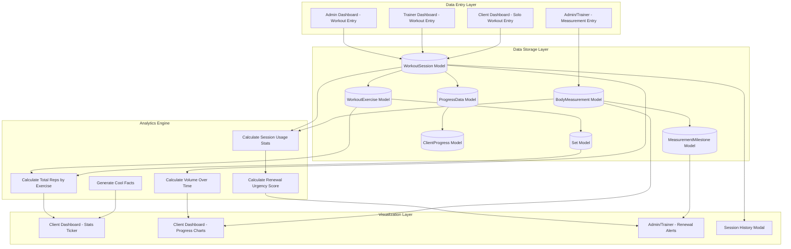
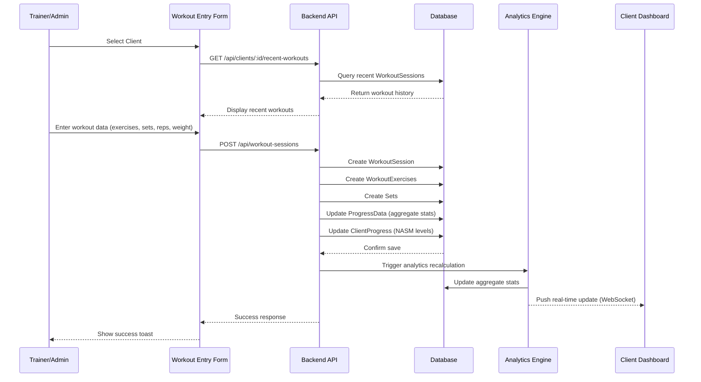
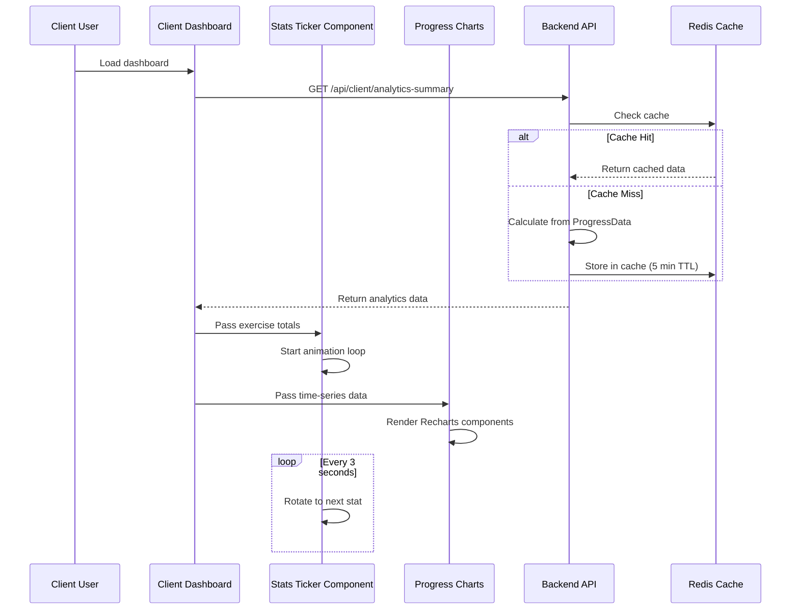
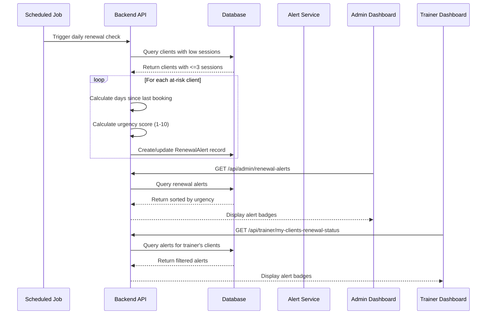

# CLIENT WORKOUT DATA SYSTEM - MASTER BLUEPRINT

## EXECUTIVE SUMMARY

This blueprint defines a comprehensive workout data entry, visualization, and analytics system for SwanStudios PT, integrating NASM functional training principles with gamification, AI-powered insights, and session renewal tracking.

**System Goals:**
1. Enable trainers/admins to enter client workout data efficiently
2. Enable clients to self-log solo workouts (tracked separately from trainer sessions)
3. Track comprehensive body measurements with auto-comparison to historical data
4. Display rich analytics and "cool facts" to clients via animated ticker
5. Provide persistent data storage with chart visualizations
6. Track session usage and trigger renewal alerts via progress milestones
7. Integrate seamlessly with existing dashboard tabs
8. Follow NASM-based functional training methodology
9. Maintain SwanStudios brand aesthetic (cosmic/neon gradients)

**Related Systems:**
- See [BODY-MEASUREMENTS-TRACKING-SYSTEM.md](./BODY-MEASUREMENTS-TRACKING-SYSTEM.md) for detailed measurement tracking specs

---

## SYSTEM ARCHITECTURE OVERVIEW



**Note:** Clients can self-enter solo workouts via Client Dashboard. These are marked with `recordedBy = userId` and `sessionType = 'solo'` to differentiate from trainer-led sessions. All workout data (trainer-led + solo) is pooled together for analytics and chart generation.

---

## DATA FLOW DIAGRAMS

### 1. Workout Data Entry Flow



### 2. Client Dashboard Data Display Flow



### 3. Session Renewal Alert Flow



---

## DATABASE SCHEMA ENHANCEMENTS

### Existing Models (Already Implemented)

**WorkoutSession** - `backend/models/WorkoutSession.mjs`
- ✅ Already has: userId, duration, intensity, totalWeight, totalReps, totalSets, avgRPE, experiencePoints
- ✅ Status tracking: planned, in_progress, completed, skipped, cancelled
- ✅ Timestamps: startedAt, completedAt

**WorkoutExercise** - `backend/models/WorkoutExercise.mjs`
- ✅ Already has: workoutSessionId, exerciseId, orderInWorkout, targetSets, targetReps, actualSets, actualReps
- ✅ Performance tracking: formQualityScore (1-10), romDegrees, painLevel (0-10)

**Set** - `backend/models/Set.mjs`
- ✅ Already has: workoutExerciseId, setNumber, reps, weight, restSeconds
- ✅ Performance: rpe (Rate of Perceived Exertion 1-10), formQualityScore

**ProgressData** - `backend/models/ProgressData.mjs`
- ✅ Comprehensive daily aggregate tracking
- ✅ All necessary fields for analytics (repsCompleted, setsCompleted, workoutsCompleted, etc.)

**ClientProgress** - `backend/models/ClientProgress.mjs`
- ✅ NASM category levels (0-1000 scale)
- ✅ Body part progression
- ✅ Key exercise tracking (squats, lunges, planks, etc.)

### New Model: RenewalAlert

**Purpose:** Track clients approaching session exhaustion for proactive renewal outreach

**File:** `backend/models/RenewalAlert.mjs`

```javascript
{
  id: UUID (primary key),
  userId: UUID (foreign key to Users),
  sessionsRemaining: INTEGER,
  lastSessionDate: DATE,
  daysSinceLastSession: INTEGER,
  urgencyScore: INTEGER (1-10 scale),
  status: ENUM ['active', 'contacted', 'renewed', 'dismissed'],
  contactedAt: DATE,
  contactedBy: UUID (foreign key to Users - trainer/admin),
  notes: TEXT,
  renewedAt: DATE,
  dismissedAt: DATE,
  createdAt: DATE,
  updatedAt: DATE
}
```

**Urgency Score Algorithm:**
```javascript
// Urgency Score (1-10)
// 10 = CRITICAL (0 sessions, >7 days inactive)
// 7-9 = HIGH (1-2 sessions, >5 days inactive)
// 4-6 = MEDIUM (3 sessions, >3 days inactive)
// 1-3 = LOW (monitoring)

function calculateUrgencyScore(sessionsRemaining, daysSinceLastSession) {
  let score = 0;

  // Sessions component (0-5 points)
  if (sessionsRemaining === 0) score += 5;
  else if (sessionsRemaining === 1) score += 4;
  else if (sessionsRemaining === 2) score += 3;
  else if (sessionsRemaining === 3) score += 2;

  // Inactivity component (0-5 points)
  if (daysSinceLastSession >= 14) score += 5;
  else if (daysSinceLastSession >= 10) score += 4;
  else if (daysSinceLastSession >= 7) score += 3;
  else if (daysSinceLastSession >= 5) score += 2;
  else if (daysSinceLastSession >= 3) score += 1;

  return Math.min(score, 10);
}
```

---

## COMPONENT ARCHITECTURE

### 1. Admin/Trainer: Workout Data Entry Component

**File:** `frontend/src/components/DashBoard/Pages/admin-dashboard/WorkoutDataEntry.tsx`

**Location:** New tab in Admin Dashboard (alongside Schedule, Analytics, etc.)

**Features:**
- Client selector dropdown with search/filter
- Quick access to client's recent workouts
- Exercise selector from NASM-aligned Exercise library
- Set/rep/weight entry with keyboard shortcuts
- Form quality scoring (1-10)
- RPE tracking (Rate of Perceived Exertion)
- Notes field for trainer observations
- Auto-save drafts
- Mobile-responsive design

**UI Wireframe:**
```
┌─────────────────────────────────────────────────────────────┐
│ 🏋️ Workout Data Entry                          [Save] [?]   │
├─────────────────────────────────────────────────────────────┤
│                                                               │
│ Client: [Sean Swan ▼]                  Date: [Jan 2, 2026]  │
│                                                               │
│ Recent Workouts:                                             │
│ ┌───────────────────────────────────────────────────────┐   │
│ │ Jan 1 - Upper Body Push (45 min) - 8 exercises        │   │
│ │ Dec 30 - Lower Body Pull (50 min) - 9 exercises       │   │
│ └───────────────────────────────────────────────────────┘   │
│                                                               │
│ Add Exercise: [Search exercises...          ] [+ New]       │
│                                                               │
│ ┌─ Barbell Back Squat ────────────────────────── [×] ───┐   │
│ │ Category: Core/Compound | Primary: Glutes, Quads      │   │
│ │                                                         │   │
│ │ Set 1: [135] lbs × [10] reps  RPE: [7/10]  Form: [8]  │   │
│ │ Set 2: [155] lbs × [8] reps   RPE: [8/10]  Form: [8]  │   │
│ │ Set 3: [175] lbs × [6] reps   RPE: [9/10]  Form: [7]  │   │
│ │                                     [+ Add Set]         │   │
│ │ Notes: [Great depth, knees tracking well]               │   │
│ └─────────────────────────────────────────────────────────┘   │
│                                                               │
│ ┌─ Bench Press ──────────────────────────────── [×] ───┐   │
│ │ Category: Core/Compound | Primary: Chest, Triceps     │   │
│ │ Set 1: [185] lbs × [8] reps   RPE: [7/10]  Form: [9]  │   │
│ │                                     [+ Add Set]         │   │
│ └─────────────────────────────────────────────────────────┘   │
│                                                               │
│ [+ Add Another Exercise]                                     │
│                                                               │
│ Session Summary:                                             │
│ Duration: [45] min  Intensity: [●●●●●●●○○○] 7/10           │
│ Total Volume: 4,840 lbs  |  Total Reps: 32                  │
│                                                               │
│ Trainer Notes:                                               │
│ [Excellent session - progressing well on squats. Consider   │
│  adding pause reps next week for depth control.]             │
│                                                               │
│              [Save Draft]  [Save & Complete Workout]         │
└─────────────────────────────────────────────────────────────┘
```

**Component State Management:**
```typescript
interface WorkoutDataEntryState {
  selectedClient: User | null;
  workoutDate: Date;
  exercises: WorkoutExerciseEntry[];
  duration: number;
  intensity: number;
  trainerNotes: string;
  isDraft: boolean;
  autoSaveStatus: 'saved' | 'saving' | 'error';
}

interface WorkoutExerciseEntry {
  exerciseId: string;
  exercise: Exercise; // From library
  sets: SetEntry[];
  notes: string;
  orderInWorkout: number;
}

interface SetEntry {
  setNumber: number;
  reps: number;
  weight: number;
  rpe: number; // 1-10
  formQualityScore: number; // 1-10
  restSeconds: number;
}
```

---

### 2. Client Dashboard: Solo Workout Entry Component

**File:** `frontend/src/components/DashBoard/Pages/client-dashboard/ClientWorkoutEntry.tsx`

**Location:** New tab in Client Dashboard OR modal accessible via floating action button

**Purpose:** Enable clients to log their own workouts when training solo (without a trainer). This data is pooled with trainer-entered workouts for comprehensive analytics.

**Features:**
- Simplified interface (compared to admin version)
- Exercise search from same NASM library
- Quick-add for favorite/recent exercises
- Set/rep/weight tracking
- RPE (Rate of Perceived Exertion) self-assessment
- Session type badge: "Solo Workout 🏋️"
- Auto-tags workout as `sessionType: 'solo'` and `recordedBy: userId`
- Mobile-first design (clients often log at gym on phone)
- Offline mode with sync when online
- Workout templates (save common routines)

**UI Wireframe (Mobile-First):**
```
┌─────────────────────────────────────────┐
│ 💪 LOG SOLO WORKOUT          [Save] [×] │
├─────────────────────────────────────────┤
│                                          │
│ Date: [Today, Jan 2] 📅                 │
│                                          │
│ Quick Add:                               │
│ [Upper Body] [Lower Body] [Cardio]      │
│                                          │
│ OR Search: [Find exercise...     ] 🔍   │
│                                          │
│ ┌─ Today's Exercises ────────────────┐  │
│ │                                     │  │
│ │ 💪 Bench Press             [×] [↑↓] │  │
│ │ ┌─────────────────────────────────┐ │  │
│ │ │ Set 1: 185 lbs × 8 reps  RPE: 7│ │  │
│ │ │ Set 2: 185 lbs × 8 reps  RPE: 7│ │  │
│ │ │ Set 3: 185 lbs × 6 reps  RPE: 9│ │  │
│ │ │         [+ Add Set] [Copy Last]│ │  │
│ │ └─────────────────────────────────┘ │  │
│ │                                     │  │
│ │ 🦵 Squats                  [×] [↑↓] │  │
│ │ ┌─────────────────────────────────┐ │  │
│ │ │ Set 1: 225 lbs × 10 reps RPE: 6│ │  │
│ │ │         [+ Add Set] [Copy Last]│ │  │
│ │ └─────────────────────────────────┘ │  │
│ │                                     │  │
│ └─────────────────────────────────────┘  │
│                                          │
│ [+ Add Exercise]                         │
│                                          │
│ How was your workout?                    │
│ Intensity: [●●●●●●●○○○] 7/10            │
│ Duration: [45] minutes                   │
│                                          │
│ Notes (optional):                        │
│ [Felt strong today, hit new PR on       │
│  bench!]                                 │
│                                          │
│ ┌─ Summary ──────────────────────────┐  │
│ │ Total Volume: 3,290 lbs            │  │
│ │ Total Reps: 32                     │  │
│ │ XP to Earn: +120 🏆                │  │
│ └────────────────────────────────────┘  │
│                                          │
│      [Save as Template]  [Complete]     │
└─────────────────────────────────────────┘
```

**TypeScript Interface:**
```typescript
interface ClientWorkoutEntryProps {
  userId: string;
  onWorkoutCompleted?: (workoutId: string) => void;
}

interface ClientWorkoutEntryState {
  workoutDate: Date;
  exercises: WorkoutExerciseEntry[];
  duration: number; // minutes
  intensity: number; // 1-10
  notes: string;
  isDraft: boolean;
  isOffline: boolean;
  autoSaveStatus: 'saved' | 'saving' | 'error';
}

interface WorkoutExerciseEntry {
  exerciseId: string;
  exercise: Exercise;
  sets: SetEntry[];
  orderInWorkout: number;
}

interface SetEntry {
  setNumber: number;
  reps: number;
  weight: number;
  rpe: number; // 1-10 (simplified - no form quality for self-entry)
}
```

**Key Implementation Details:**

**1. Session Type Differentiation:**
```typescript
// When saving client self-entry workout
const workoutData = {
  userId: currentUser.id,
  recordedBy: currentUser.id, // Same as userId for solo workouts
  sessionType: 'solo', // Flag to distinguish from trainer-led
  sessionDate: workoutDate,
  duration,
  intensity,
  status: 'completed',
  exercises: [/* ... */],
  notes,
  // These fields are NULL for solo workouts:
  trainerId: null,
  sessionId: null // Not linked to a booked session
};
```

**2. Offline Mode with IndexedDB:**
```typescript
// Save to IndexedDB if offline
if (!navigator.onLine) {
  await saveWorkoutToIndexedDB(workoutData);
  toast({
    title: "Saved Offline",
    description: "Will sync when you're back online",
  });
  return;
}

// Sync when online
window.addEventListener('online', async () => {
  const offlineWorkouts = await getOfflineWorkouts();
  for (const workout of offlineWorkouts) {
    await authAxios.post('/api/workout-sessions', workout);
    await deleteFromIndexedDB(workout.localId);
  }
  toast({
    title: "Synced",
    description: `${offlineWorkouts.length} workout(s) uploaded`,
  });
});
```

**3. Workout Templates:**
```typescript
// Save current workout as template
const handleSaveTemplate = async () => {
  const template = {
    userId,
    name: templateName, // e.g., "Upper Body Push Day"
    exercises: exercises.map(ex => ({
      exerciseId: ex.exerciseId,
      orderInWorkout: ex.orderInWorkout,
      targetSets: ex.sets.length,
      targetReps: Math.round(ex.sets.reduce((sum, s) => sum + s.reps, 0) / ex.sets.length),
      targetWeight: Math.round(ex.sets.reduce((sum, s) => sum + s.weight, 0) / ex.sets.length)
    }))
  };

  await authAxios.post('/api/workout-templates', template);
  toast({
    title: "Template Saved",
    description: "Quick-load this workout next time!",
  });
};

// Load template
const handleLoadTemplate = async (templateId: string) => {
  const template = await authAxios.get(`/api/workout-templates/${templateId}`);

  setExercises(template.data.exercises.map(ex => ({
    ...ex,
    sets: Array(ex.targetSets).fill(null).map((_, idx) => ({
      setNumber: idx + 1,
      reps: ex.targetReps,
      weight: ex.targetWeight,
      rpe: 7 // Default
    }))
  })));
};
```

**4. XP & Gamification:**
```typescript
// Calculate XP earned from solo workout
const calculateWorkoutXP = (exercises: WorkoutExerciseEntry[]) => {
  let xp = 0;

  // Base XP for completing workout
  xp += 50;

  // XP per exercise (defined in Exercise model)
  exercises.forEach(ex => {
    xp += ex.exercise.experiencePointsEarned || 10;
  });

  // Bonus XP for high intensity
  if (intensity >= 8) {
    xp += 30; // High intensity bonus
  }

  // Bonus XP for volume
  const totalReps = exercises.reduce((sum, ex) =>
    sum + ex.sets.reduce((s, set) => s + set.reps, 0), 0
  );

  if (totalReps >= 100) {
    xp += 20; // Volume warrior bonus
  }

  return xp;
};
```

**5. Integration with Analytics:**
All solo workouts are automatically included in:
- Stats Ticker (exercise totals pool all sources)
- Progress Charts (volume over time includes solo + trainer-led)
- NASM Progression (solo workouts count toward category levels)
- Streaks & Consistency (solo workouts maintain streak)

**Backend Differentiation:**
```javascript
// In analytics queries, pool ALL workouts:
const allWorkouts = await WorkoutSession.findAll({
  where: {
    userId: clientId,
    status: 'completed'
    // No filter on sessionType - include both 'solo' and 'trainer-led'
  }
});

// If you need to separate them:
const soloWorkouts = allWorkouts.filter(w => w.sessionType === 'solo');
const trainerLedWorkouts = allWorkouts.filter(w => w.sessionType === 'trainer-led');
```

**Access Control:**
- Clients can ONLY edit their own solo workouts
- Clients CANNOT edit trainer-entered workouts
- Trainers/Admins can view both types but see indicator badge

**Mobile Optimizations:**
- Large tap targets (min 44px)
- Number inputs use `inputMode="decimal"` for number pad
- Haptic feedback on iOS when set completed
- Swipe to delete sets/exercises
- Pull-to-refresh for exercise library

---

### 3. Client Dashboard: Stats Ticker Component

**File:** `frontend/src/components/DashBoard/Pages/client-dashboard/StatsTickerBar.tsx`

**Location:** Integrated into client-dashboard-view.tsx (below header, above main content)

**Features:**
- Horizontal auto-scrolling ticker
- Displays total reps for each exercise the client has data for
- Animates between different stats every 3 seconds
- Cosmic gradient background with glow effects
- Mobile-responsive (stacks vertically on small screens)
- Pause on hover
- Click to view detailed breakdown modal

**UI Wireframe:**
```
┌─────────────────────────────────────────────────────────────────────────────┐
│ 🏆 YOUR TRAINING STATS ─────────────────────────────────────────────────── │
│                                                                              │
│  💪 1,247 TOTAL PUSHUPS  │  🦵 893 SQUATS  │  🏋️ 45,230 LBS TOTAL VOLUME  │
│                                                                              │
│  [Stats rotate every 3 seconds with smooth fade animation]                 │
└─────────────────────────────────────────────────────────────────────────────┘
```

**Stat Categories to Display:**
1. **Exercise Totals** (Top 10 most-performed exercises)
   - "1,247 Total Pushups"
   - "893 Squats Completed"
   - "456 Deadlifts"
   - "2,103 Crunches"

2. **Volume Stats**
   - "45,230 lbs Total Weight Lifted"
   - "12,456 Total Reps Completed"
   - "1,203 Total Sets"

3. **Milestone Stats**
   - "42 Workouts This Year"
   - "18 Day Current Streak 🔥"
   - "Level 23 Strength Warrior"

4. **NASM Category Progress**
   - "Core Strength: Level 456/1000"
   - "Balance: Level 234/1000"
   - "Flexibility: Level 189/1000"

5. **Cool Facts** (AI-Generated)
   - "That's equivalent to lifting a compact car!"
   - "You've done more pushups than the average person does in 5 years"
   - "Your squat volume could deadlift a horse"

**Animation Pattern:**
```typescript
// Rotate through stats categories
const statCategories = [
  'exerciseTotals',    // Show 3s
  'volumeStats',       // Show 3s
  'milestoneStats',    // Show 3s
  'nasmProgress',      // Show 3s
  'coolFacts'          // Show 3s
];

// Within each category, rotate through 3-5 individual stats
// Total cycle time: ~15-25 seconds before repeating
```

**Component Structure:**
```typescript
interface StatsTickerBarProps {
  userId: string;
}

interface TickerStat {
  icon: string;
  label: string;
  value: string | number;
  suffix?: string;
  category: 'exercise' | 'volume' | 'milestone' | 'nasm' | 'coolFact';
}

const StatsTickerBar: React.FC<StatsTickerBarProps> = ({ userId }) => {
  const [currentStatIndex, setCurrentStatIndex] = useState(0);
  const [stats, setStats] = useState<TickerStat[]>([]);
  const [isPaused, setIsPaused] = useState(false);

  // Fetch stats from API
  useEffect(() => {
    fetchClientStats(userId).then(setStats);
  }, [userId]);

  // Auto-rotate stats
  useEffect(() => {
    if (isPaused) return;
    const interval = setInterval(() => {
      setCurrentStatIndex((prev) => (prev + 1) % stats.length);
    }, 3000);
    return () => clearInterval(interval);
  }, [isPaused, stats.length]);

  return (
    <div
      className="stats-ticker-bar"
      onMouseEnter={() => setIsPaused(true)}
      onMouseLeave={() => setIsPaused(false)}
    >
      <AnimatePresence mode="wait">
        <motion.div
          key={currentStatIndex}
          initial={{ opacity: 0, y: 20 }}
          animate={{ opacity: 1, y: 0 }}
          exit={{ opacity: 0, y: -20 }}
          transition={{ duration: 0.5 }}
        >
          {stats[currentStatIndex] && (
            <div className="stat-display">
              <span className="icon">{stats[currentStatIndex].icon}</span>
              <span className="value">{stats[currentStatIndex].value}</span>
              <span className="label">{stats[currentStatIndex].label}</span>
            </div>
          )}
        </motion.div>
      </AnimatePresence>
    </div>
  );
};
```

---

### 3. Client Dashboard: Enhanced Progress Charts

**File:** `frontend/src/components/DashBoard/Pages/client-dashboard/WorkoutProgressCharts.tsx`

**Location:** Integrated into client-dashboard-view.tsx (main content area)

**Charts to Display:**

#### a) Volume Over Time (Line Chart)
- X-axis: Date (last 6 months)
- Y-axis: Total weight lifted (lbs)
- Show trend line
- Mark PRs (Personal Records)

#### b) Exercise Frequency Heatmap
- X-axis: Days of week (Mon-Sun)
- Y-axis: Weeks (last 12 weeks)
- Color intensity = workout frequency
- Similar to GitHub contribution graph

#### c) NASM Category Radar Chart
- Already exists: `frontend/src/components/ClientProgressCharts/NASMCategoryRadar.tsx`
- Enhance with current data

#### d) Top Exercises Breakdown (Bar Chart)
- X-axis: Exercise names (top 10)
- Y-axis: Total reps completed
- Color-coded by NASM category

**Component Structure:**
```typescript
const WorkoutProgressCharts: React.FC<{ userId: string }> = ({ userId }) => {
  const [chartData, setChartData] = useState<ChartData | null>(null);
  const [timeRange, setTimeRange] = useState<'1M' | '3M' | '6M' | '1Y'>('6M');

  return (
    <div className="workout-progress-charts">
      <div className="chart-controls">
        <button onClick={() => setTimeRange('1M')}>1 Month</button>
        <button onClick={() => setTimeRange('3M')}>3 Months</button>
        <button onClick={() => setTimeRange('6M')}>6 Months</button>
        <button onClick={() => setTimeRange('1Y')}>1 Year</button>
      </div>

      <div className="charts-grid">
        <VolumeOverTimeChart data={chartData?.volumeData} />
        <ExerciseFrequencyHeatmap data={chartData?.frequencyData} />
        <NASMCategoryRadar data={chartData?.nasmData} />
        <TopExercisesBar data={chartData?.topExercises} />
      </div>
    </div>
  );
};
```

---

### 4. Admin/Trainer: Renewal Alert Dashboard Widget

**File:** `frontend/src/components/DashBoard/Pages/admin-dashboard/RenewalAlertWidget.tsx`

**Location:** Admin Dashboard - Analytics tab (new panel) + Trainer Dashboard (sidebar widget)

**Features:**
- Displays clients sorted by urgency score (10 → 1)
- Color-coded badges (Red = Critical, Orange = High, Yellow = Medium)
- Click to view client details
- "Mark as Contacted" action
- Quick booking link
- Filter by trainer (admin view)

**UI Wireframe:**
```
┌─────────────────────────────────────────────────────────┐
│ 🚨 SESSION RENEWAL ALERTS                    [Filter ▼] │
├─────────────────────────────────────────────────────────┤
│                                                          │
│ ┌─ CRITICAL (3) ──────────────────────────────────────┐ │
│ │ 🔴 Sarah Johnson - 0 sessions, 12 days inactive     │ │
│ │    Last: Dec 21 | Score: 10/10  [Contact] [Book]   │ │
│ │                                                       │ │
│ │ 🔴 Mike Davis - 0 sessions, 8 days inactive         │ │
│ │    Last: Dec 25 | Score: 9/10   [Contact] [Book]   │ │
│ └───────────────────────────────────────────────────────┘ │
│                                                          │
│ ┌─ HIGH (5) ───────────────────────────────────────────┐ │
│ │ 🟠 Emma Wilson - 1 session, 7 days inactive         │ │
│ │    Last: Dec 26 | Score: 8/10   [Contact] [Book]   │ │
│ │                                                       │ │
│ │ 🟠 James Brown - 2 sessions, 6 days inactive        │ │
│ │    Last: Dec 27 | Score: 7/10   [Contact] [Book]   │ │
│ └───────────────────────────────────────────────────────┘ │
│                                                          │
│ ┌─ MEDIUM (8) ─────────────────────────────────────────┐ │
│ │ 🟡 Lisa Martinez - 3 sessions, 4 days inactive      │ │
│ │    Last: Dec 29 | Score: 5/10   [Contact] [Book]   │ │
│ └───────────────────────────────────────────────────────┘ │
│                                                          │
│              [View All Alerts (16 total)]               │
└─────────────────────────────────────────────────────────┘
```

---

## API ENDPOINTS

### Workout Data Entry

#### POST `/api/workout-sessions`
Create new workout session with exercises and sets

**Request Body:**
```json
{
  "userId": "uuid",
  "sessionDate": "2026-01-02T10:30:00Z",
  "duration": 45,
  "intensity": 7,
  "status": "completed",
  "exercises": [
    {
      "exerciseId": "uuid",
      "orderInWorkout": 1,
      "notes": "Great depth, knees tracking well",
      "sets": [
        {
          "setNumber": 1,
          "reps": 10,
          "weight": 135,
          "rpe": 7,
          "formQualityScore": 8,
          "restSeconds": 90
        }
      ]
    }
  ],
  "trainerNotes": "Excellent session - progressing well"
}
```

**Response:**
```json
{
  "success": true,
  "workoutSession": { /* WorkoutSession object */ },
  "experiencePointsEarned": 150,
  "achievementsUnlocked": ["squat_100_reps"],
  "progressUpdated": {
    "coreLevel": 456,
    "overallLevel": 23
  }
}
```

#### GET `/api/workout-sessions/:userId`
Get workout history for a client

**Query Params:**
- `limit` (default: 10)
- `offset` (default: 0)
- `startDate` (optional)
- `endDate` (optional)
- `status` (optional: completed, in_progress, etc.)

**Response:**
```json
{
  "workouts": [
    {
      "id": "uuid",
      "sessionDate": "2026-01-01T10:00:00Z",
      "duration": 45,
      "exerciseCount": 8,
      "totalVolume": 4840,
      "totalReps": 32,
      "status": "completed"
    }
  ],
  "total": 42,
  "hasMore": true
}
```

---

### Analytics Endpoints

#### GET `/api/client/analytics-summary/:userId`
Get comprehensive analytics for client dashboard ticker and charts

**Response:**
```json
{
  "exerciseTotals": [
    { "exerciseName": "Pushups", "totalReps": 1247, "icon": "💪" },
    { "exerciseName": "Squats", "totalReps": 893, "icon": "🦵" },
    { "exerciseName": "Deadlifts", "totalReps": 456, "icon": "🏋️" }
  ],
  "volumeStats": {
    "totalWeightLifted": 45230,
    "totalReps": 12456,
    "totalSets": 1203,
    "totalWorkouts": 42
  },
  "milestoneStats": {
    "currentStreak": 18,
    "longestStreak": 24,
    "level": 23,
    "totalXp": 45600
  },
  "nasmProgress": {
    "core": 456,
    "balance": 234,
    "flexibility": 189,
    "calisthenics": 567
  },
  "coolFacts": [
    "That's equivalent to lifting a compact car!",
    "You've done more pushups than the average person does in 5 years"
  ],
  "chartData": {
    "volumeOverTime": [
      { "date": "2025-07-01", "volume": 3200 },
      { "date": "2025-08-01", "volume": 3850 }
    ],
    "frequencyHeatmap": [ /* 12 weeks of data */ ],
    "topExercises": [ /* Top 10 exercises by reps */ ]
  }
}
```

#### GET `/api/client/exercise-totals/:userId`
Get total reps/sets for each exercise

**Response:**
```json
{
  "exercises": [
    {
      "exerciseId": "uuid",
      "exerciseName": "Barbell Back Squat",
      "totalReps": 893,
      "totalSets": 124,
      "totalVolume": 89430,
      "firstPerformed": "2025-03-15",
      "lastPerformed": "2026-01-01",
      "personalRecord": {
        "weight": 315,
        "reps": 5,
        "date": "2025-12-15"
      }
    }
  ]
}
```

---

### Renewal Alert Endpoints

#### GET `/api/admin/renewal-alerts`
Get all renewal alerts sorted by urgency

**Query Params:**
- `status` (optional: active, contacted, renewed, dismissed)
- `urgencyMin` (optional: 1-10)
- `trainerId` (optional: filter by trainer)

**Response:**
```json
{
  "alerts": [
    {
      "id": "uuid",
      "user": {
        "id": "uuid",
        "name": "Sarah Johnson",
        "email": "sarah@example.com",
        "avatarUrl": "https://..."
      },
      "sessionsRemaining": 0,
      "lastSessionDate": "2025-12-21",
      "daysSinceLastSession": 12,
      "urgencyScore": 10,
      "status": "active",
      "trainer": {
        "id": "uuid",
        "name": "Sean Swan"
      }
    }
  ],
  "summary": {
    "critical": 3,
    "high": 5,
    "medium": 8,
    "total": 16
  }
}
```

#### POST `/api/admin/renewal-alerts/:id/contact`
Mark alert as contacted

**Request Body:**
```json
{
  "notes": "Called client, left voicemail",
  "contactedBy": "uuid"
}
```

#### POST `/api/admin/renewal-alerts/:id/dismiss`
Dismiss an alert (client declined renewal, moved away, etc.)

---

## INTEGRATION PLAN

### Phase 1: Data Entry Foundation (Week 1)
- Create WorkoutDataEntry component for Admin Dashboard
- Add new tab "Workout Entry" to admin-dashboard-view.tsx
- Implement backend POST /api/workout-sessions endpoint
- Create GET /api/workout-sessions/:userId endpoint
- Test with sample workout data

### Phase 2: Analytics Engine (Week 2)
- Implement analytics calculation functions
- Create GET /api/client/analytics-summary endpoint
- Implement caching layer (Redis) for analytics
- Create scheduled job for daily analytics recalculation
- Test performance with 1000+ workout records

### Phase 3: Client Dashboard Visualization (Week 3)
- Create StatsTickerBar component
- Integrate into client-dashboard-view.tsx
- Create WorkoutProgressCharts component
- Implement chart data formatting helpers
- Test animations and responsiveness

### Phase 4: Renewal Alert System (Week 4)
- Create RenewalAlert model and migration
- Implement urgency score calculation
- Create scheduled job for daily alert generation
- Create RenewalAlertWidget component
- Integrate into Admin Analytics tab
- Create trainer-specific renewal widget

### Phase 5: Polish & Testing (Week 5)
- Mobile responsive testing
- Performance optimization
- Accessibility (WCAG AA compliance)
- E2E testing for workout entry flow
- Load testing for analytics endpoints
- User acceptance testing

---

## NASM INTEGRATION

### NASM Phase Alignment

**Phase 1: Stabilization Endurance**
- Focus: Core, Balance, Stability exercises
- Progression: 0-200 level
- Exercises: Planks, Single-leg balance, Stability ball work

**Phase 2: Strength Endurance**
- Focus: Compound movements with moderate weight
- Progression: 201-400 level
- Exercises: Goblet squats, Dumbbell bench press, Rows

**Phase 3: Hypertrophy**
- Focus: Muscle building with controlled tempo
- Progression: 401-600 level
- Exercises: Barbell squats, Bench press, Deadlifts

**Phase 4: Maximal Strength**
- Focus: Heavy compound lifts
- Progression: 601-800 level
- Exercises: Heavy squats, Heavy deadlifts, Heavy presses

**Phase 5: Power**
- Focus: Explosive movements
- Progression: 801-1000 level
- Exercises: Olympic lifts, Plyometrics, Speed work

### Data Entry Recommendations Based on NASM Phase

When trainer enters workout data, system should:
1. Display client's current NASM phase
2. Suggest exercises appropriate for their phase
3. Warn if exercise is too advanced for current level
4. Automatically calculate phase progression based on performance
5. Recommend phase advancement when client hits 80% of current phase level

---

## SWANSTUDIOS BRAND STYLING

### Color Palette
- Primary: Cosmic Purple (#8B5CF6)
- Secondary: Neon Cyan (#06B6D4)
- Accent: Emerald (#10B981)
- Dark: Deep Space (#0F172A)
- Glow Effects: Purple/Cyan radial gradients

### Typography
- Headers: Font-bold, tracking-tight
- Stats: Font-mono for numbers
- Body: System font stack

### Animation Principles
- Smooth transitions (300-500ms)
- Framer Motion for complex animations
- Glow effects on hover
- Fade in/out for stat rotations
- Stagger animations for list items

### Component Patterns
- GlowButton with theme prop (cosmic, emerald, purple)
- Gradient backgrounds with `bg-gradient-to-r from-purple-500/20 to-cyan-500/20`
- Backdrop blur for glassmorphism effect
- Neon borders with `border-cyan-400/50`

---

## WIREFRAME: Complete System Overview

```
┌────────────────────────────────────────────────────────────────────────┐
│                        ADMIN DASHBOARD                                  │
├────────────────────────────────────────────────────────────────────────┤
│ Tabs: [Schedule] [Analytics] [Users] [Trainers] [Workout Entry] ...   │
│                                                                          │
│ ┌─ WORKOUT ENTRY TAB ──────────────────────────────────────────────┐  │
│ │ Client: [Select Client ▼]          Date: [Jan 2, 2026]          │  │
│ │                                                                   │  │
│ │ Recent Workouts: [List of 3 most recent workouts]               │  │
│ │                                                                   │  │
│ │ Add Exercise: [Search...]                                        │  │
│ │                                                                   │  │
│ │ Exercise 1: [Barbell Back Squat]                        [×]      │  │
│ │   Set 1: [135] lbs × [10] reps  RPE: [7]  Form: [8]            │  │
│ │   Set 2: [155] lbs × [8] reps   RPE: [8]  Form: [8]            │  │
│ │   [+ Add Set]                                                    │  │
│ │                                                                   │  │
│ │ Exercise 2: [Bench Press]                               [×]      │  │
│ │   Set 1: [185] lbs × [8] reps   RPE: [7]  Form: [9]            │  │
│ │   [+ Add Set]                                                    │  │
│ │                                                                   │  │
│ │ [+ Add Exercise]                                                 │  │
│ │                                                                   │  │
│ │ Session: Duration [45] min  Intensity [7/10]                    │  │
│ │ Notes: [Excellent session...]                                    │  │
│ │                                                                   │  │
│ │                      [Save Draft]  [Complete Workout]            │  │
│ └───────────────────────────────────────────────────────────────────┘  │
│                                                                          │
│ ┌─ ANALYTICS TAB ──────────────────────────────────────────────────┐  │
│ │ [Revenue] [Users] [AI] [Renewal Alerts]                         │  │
│ │                                                                   │  │
│ │ ┌─ RENEWAL ALERTS ─────────────────────────────────────────────┐│  │
│ │ │ 🔴 CRITICAL (3)                                              ││  │
│ │ │ Sarah Johnson - 0 sessions, 12 days  [Contact] [Book]       ││  │
│ │ │ Mike Davis - 0 sessions, 8 days      [Contact] [Book]       ││  │
│ │ │                                                               ││  │
│ │ │ 🟠 HIGH (5)                                                  ││  │
│ │ │ Emma Wilson - 1 session, 7 days      [Contact] [Book]       ││  │
│ │ └───────────────────────────────────────────────────────────────┘│  │
│ └───────────────────────────────────────────────────────────────────┘  │
└────────────────────────────────────────────────────────────────────────┘

┌────────────────────────────────────────────────────────────────────────┐
│                        CLIENT DASHBOARD                                 │
├────────────────────────────────────────────────────────────────────────┤
│ ┌─ STATS TICKER ──────────────────────────────────────────────────┐   │
│ │ 🏆 YOUR TRAINING STATS                                          │   │
│ │ 💪 1,247 TOTAL PUSHUPS  │  🦵 893 SQUATS  │  🏋️ 45,230 LBS     │   │
│ └──────────────────────────────────────────────────────────────────┘   │
│                                                                          │
│ ┌─ PROGRESS CHARTS ────────────────────────────────────────────────┐  │
│ │                                                                   │  │
│ │ ┌─ Volume Over Time ──────┐  ┌─ Exercise Frequency ────────┐   │  │
│ │ │ [Line chart showing      │  │ [Heatmap showing workout    │   │  │
│ │ │  total lbs lifted over   │  │  frequency by day/week]     │   │  │
│ │ │  last 6 months]          │  │                              │   │  │
│ │ └───────────────────────────┘  └──────────────────────────────┘   │  │
│ │                                                                   │  │
│ │ ┌─ NASM Category Radar ───┐  ┌─ Top Exercises ─────────────┐   │  │
│ │ │ [Radar chart with        │  │ [Bar chart showing top 10   │   │  │
│ │ │  Core, Balance, etc.]    │  │  exercises by total reps]   │   │  │
│ │ └───────────────────────────┘  └──────────────────────────────┘   │  │
│ └───────────────────────────────────────────────────────────────────┘  │
│                                                                          │
│ ┌─ QUICK STATS ────────────────────────────────────────────────────┐  │
│ │ Workouts: 42  │  Streak: 18 days 🔥  │  Level: 23  │  XP: 45.6K │  │
│ └───────────────────────────────────────────────────────────────────┘  │
└────────────────────────────────────────────────────────────────────────┘

┌────────────────────────────────────────────────────────────────────────┐
│                      TRAINER DASHBOARD                                  │
├────────────────────────────────────────────────────────────────────────┤
│ [My Sessions] [My Clients] [Schedule] [Workout Entry]                  │
│                                                                          │
│ ┌─ SIDEBAR WIDGET ─────────────────────────────────────────────────┐  │
│ │ 🚨 CLIENT ALERTS (8)                                             │  │
│ │                                                                   │  │
│ │ 🔴 Sarah Johnson - 0 sessions  [Contact]                        │  │
│ │ 🟠 Emma Wilson - 1 session     [Contact]                        │  │
│ │ 🟡 Lisa Martinez - 3 sessions  [Contact]                        │  │
│ │                                                                   │  │
│ │ [View All]                                                        │  │
│ └───────────────────────────────────────────────────────────────────┘  │
└────────────────────────────────────────────────────────────────────────┘
```

---

## FILE STRUCTURE

```
backend/
├── models/
│   ├── RenewalAlert.mjs                    [NEW]
│   ├── WorkoutSession.mjs                  [EXISTS]
│   ├── WorkoutExercise.mjs                 [EXISTS]
│   ├── Set.mjs                             [EXISTS]
│   ├── ProgressData.mjs                    [EXISTS]
│   └── ClientProgress.mjs                  [EXISTS]
│
├── controllers/
│   ├── workoutSessionController.mjs        [NEW]
│   ├── analyticsController.mjs             [NEW]
│   └── renewalAlertController.mjs          [NEW]
│
├── routes/
│   ├── workoutSessionRoutes.mjs            [NEW]
│   ├── analyticsRoutes.mjs                 [NEW]
│   └── renewalAlertRoutes.mjs              [NEW]
│
├── services/
│   ├── analyticsService.mjs                [NEW]
│   ├── renewalAlertService.mjs             [NEW]
│   └── nasmProgressionService.mjs          [NEW]
│
├── jobs/
│   ├── dailyAnalyticsRecalculation.mjs     [NEW]
│   └── dailyRenewalAlertCheck.mjs          [NEW]
│
└── migrations/
    └── 20260102000001-create-renewal-alerts.cjs  [NEW]

frontend/src/components/
├── DashBoard/Pages/
│   ├── admin-dashboard/
│   │   ├── WorkoutDataEntry.tsx            [NEW]
│   │   ├── RenewalAlertWidget.tsx          [NEW]
│   │   └── admin-dashboard-view.tsx        [MODIFY - add tabs]
│   │
│   ├── trainer-dashboard/
│   │   ├── TrainerWorkoutEntry.tsx         [NEW - reuse admin component]
│   │   └── TrainerRenewalWidget.tsx        [NEW]
│   │
│   └── client-dashboard/
│       ├── StatsTickerBar.tsx              [NEW]
│       ├── WorkoutProgressCharts.tsx       [NEW]
│       ├── ExerciseFrequencyHeatmap.tsx    [NEW]
│       ├── TopExercisesBarChart.tsx        [NEW]
│       └── client-dashboard-view.tsx       [MODIFY - add ticker & charts]
│
└── ClientProgressCharts/
    ├── VolumeOverTimeChart.tsx             [EXISTS - enhance]
    └── NASMCategoryRadar.tsx               [EXISTS - enhance]

docs/systems/
└── CLIENT-WORKOUT-DATA-SYSTEM-BLUEPRINT.md [THIS FILE]
```

---

## SUCCESS CRITERIA

### Functional Requirements
- ✅ Trainers/admins can enter workout data for any client
- ✅ All workout data is persisted to database
- ✅ Client dashboard displays animated stats ticker
- ✅ Client dashboard shows 4 types of progress charts
- ✅ System tracks session usage and generates renewal alerts
- ✅ Alerts sorted by urgency score (1-10)
- ✅ Analytics calculate total reps per exercise
- ✅ Data follows NASM progression framework

### Performance Requirements
- Analytics API response time < 500ms (with caching)
- Workout entry form saves within 2 seconds
- Charts render within 1 second
- Ticker animations smooth at 60fps
- System handles 10,000+ workout records efficiently

### UX Requirements
- Mobile-responsive on all screen sizes
- WCAG AA accessibility compliance
- SwanStudios brand styling throughout
- Smooth animations and transitions
- Intuitive workout entry workflow
- Clear visual hierarchy

### Data Quality Requirements
- Form validation prevents invalid data entry
- RPE and form scores limited to 1-10 scale
- Weight/reps must be positive numbers
- Exercise must exist in library before entry
- Timestamps accurate to the minute

---

## FUTURE ENHANCEMENTS (Post-V1)

1. **AI-Powered Workout Recommendations**
   - Based on client's NASM level and goals
   - Suggest exercises for weak categories
   - Progressive overload automation

2. **Mobile App for Workout Entry**
   - React Native app for trainers
   - Offline mode with sync
   - Voice-to-text for notes

3. **Client Self-Entry Mode**
   - Clients can log workouts themselves
   - Trainer review/approval workflow
   - Photo/video upload for form check

4. **Advanced Analytics**
   - Predict session renewal likelihood (ML model)
   - Injury risk detection based on pain tracking
   - Optimal rest day recommendations

5. **Social Features**
   - Share achievements to social feed
   - Challenge friends to exercise totals
   - Community leaderboards

---

## GEMINI HANDOFF CHECKLIST

Before handing off to Gemini for implementation:

- [ ] This blueprint document reviewed and approved
- [ ] Database schema validated
- [ ] API endpoints documented
- [ ] Component wireframes clear
- [ ] Integration points identified
- [ ] Existing tabs analyzed (no duplication)
- [ ] Brand styling guidelines confirmed
- [ ] Success criteria defined
- [ ] Phase 1 scope locked

After Gemini completes implementation:

- [ ] Code review by Claude
- [ ] TypeScript types validated
- [ ] API error handling tested
- [ ] Responsive design tested
- [ ] Accessibility audit passed
- [ ] Performance benchmarks met
- [ ] Documentation updated
- [ ] Git commit with proper message

---

**Document Version:** 1.0
**Created:** January 2, 2026
**Status:** Ready for Gemini Implementation
**Estimated Implementation Time:** 5 weeks (phased approach)
