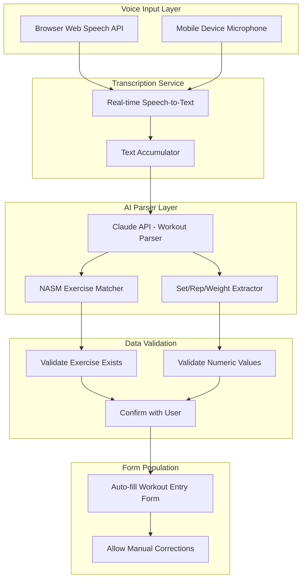
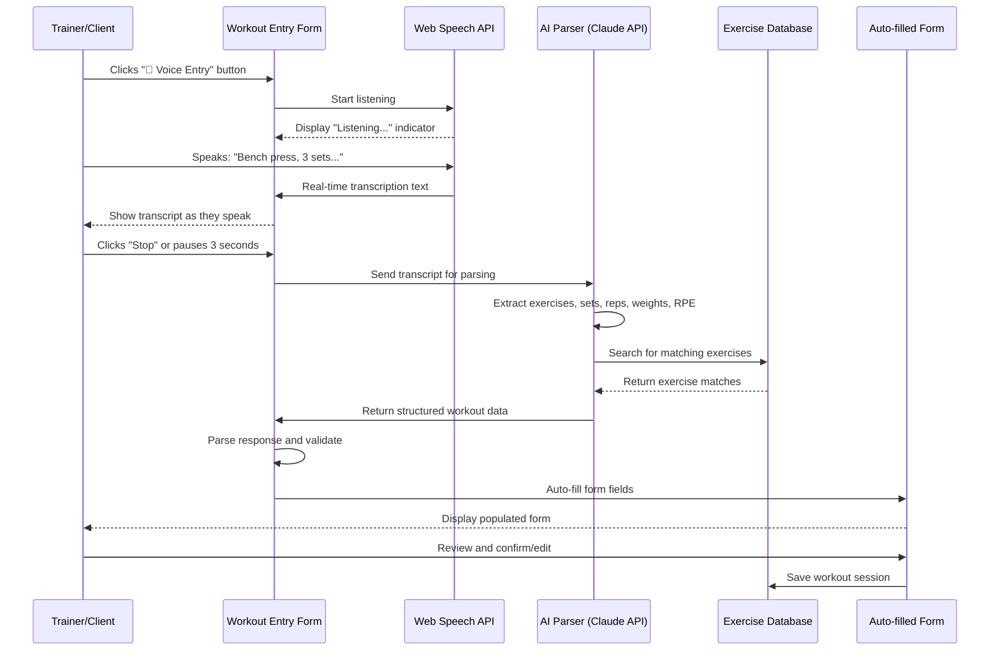

# VOICE WORKOUT ENTRY & AI PARSER SYSTEM

## EXECUTIVE SUMMARY

**Critical Feature:** Voice-to-text workout logging with AI-powered parsing to auto-fill workout data. This dramatically speeds up data entry and improves user experience for trainers, admins, and clients.

**System Goal:** Enable users to speak their workout naturally (e.g., "Bench press, 3 sets of 8 reps at 185 pounds, RPE 7") and have AI automatically parse and populate the workout entry form with correct exercises, sets, reps, weights, and RPE values.

**Expected Impact:**
- 70-80% faster data entry (30 seconds vs 3 minutes)
- Higher adoption rate (easier = more use)
- Better data quality (less manual entry errors)
- Natural, conversational interface

---

## SYSTEM ARCHITECTURE



---

## USER FLOW

### Voice Entry Flow



---

## VOICE INPUT EXAMPLES

### Example 1: Simple Workout
**User says:**
> "Bench press, 3 sets of 8 reps at 185 pounds, RPE 7. Squats, 4 sets of 10 reps at 225 pounds, RPE 8."

**AI Parses to:**
```json
{
  "exercises": [
    {
      "exerciseName": "Bench Press",
      "sets": [
        { "setNumber": 1, "reps": 8, "weight": 185, "rpe": 7 },
        { "setNumber": 2, "reps": 8, "weight": 185, "rpe": 7 },
        { "setNumber": 3, "reps": 8, "weight": 185, "rpe": 7 }
      ]
    },
    {
      "exerciseName": "Squats",
      "sets": [
        { "setNumber": 1, "reps": 10, "weight": 225, "rpe": 8 },
        { "setNumber": 2, "reps": 10, "weight": 225, "rpe": 8 },
        { "setNumber": 3, "reps": 10, "weight": 225, "rpe": 8 },
        { "setNumber": 4, "reps": 10, "weight": 225, "rpe": 8 }
      ]
    }
  ],
  "duration": null,
  "intensity": null,
  "notes": ""
}
```

### Example 2: Complex Workout with Variations
**User says:**
> "Barbell back squat, set 1 was 10 reps at 135 pounds, set 2 was 8 reps at 185 pounds, set 3 was 6 reps at 225 pounds, RPE 9 on that last one. Then I did dumbbell bench press, 3 sets of 12 reps with 50 pound dumbbells, felt pretty easy, RPE 6. Client said form was excellent today."

**AI Parses to:**
```json
{
  "exercises": [
    {
      "exerciseName": "Barbell Back Squat",
      "sets": [
        { "setNumber": 1, "reps": 10, "weight": 135, "rpe": 7 },
        { "setNumber": 2, "reps": 8, "weight": 185, "rpe": 8 },
        { "setNumber": 3, "reps": 6, "weight": 225, "rpe": 9 }
      ]
    },
    {
      "exerciseName": "Dumbbell Bench Press",
      "sets": [
        { "setNumber": 1, "reps": 12, "weight": 50, "rpe": 6 },
        { "setNumber": 2, "reps": 12, "weight": 50, "rpe": 6 },
        { "setNumber": 3, "reps": 12, "weight": 50, "rpe": 6 }
      ]
    }
  ],
  "duration": null,
  "intensity": 6,
  "notes": "Client said form was excellent today."
}
```

### Example 3: Bodyweight Exercises
**User says:**
> "Pushups, 3 sets of 20 reps, RPE 7. Pull-ups, 4 sets of 8 reps, RPE 9. Plank hold for 60 seconds, 3 sets. Workout was 45 minutes total, intensity was about an 8 out of 10."

**AI Parses to:**
```json
{
  "exercises": [
    {
      "exerciseName": "Pushups",
      "sets": [
        { "setNumber": 1, "reps": 20, "weight": 0, "rpe": 7 },
        { "setNumber": 2, "reps": 20, "weight": 0, "rpe": 7 },
        { "setNumber": 3, "reps": 20, "weight": 0, "rpe": 7 }
      ]
    },
    {
      "exerciseName": "Pull-ups",
      "sets": [
        { "setNumber": 1, "reps": 8, "weight": 0, "rpe": 9 },
        { "setNumber": 2, "reps": 8, "weight": 0, "rpe": 9 },
        { "setNumber": 3, "reps": 8, "weight": 0, "rpe": 9 },
        { "setNumber": 4, "reps": 8, "weight": 0, "rpe": 9 }
      ]
    },
    {
      "exerciseName": "Plank",
      "sets": [
        { "setNumber": 1, "duration": 60, "reps": 0, "weight": 0, "rpe": 7 },
        { "setNumber": 2, "duration": 60, "reps": 0, "weight": 0, "rpe": 7 },
        { "setNumber": 3, "duration": 60, "reps": 0, "weight": 0, "rpe": 7 }
      ]
    }
  ],
  "duration": 45,
  "intensity": 8,
  "notes": ""
}
```

---

## AI PARSER PROMPT

**System Prompt for Claude API:**

```
You are a workout data parser for SwanStudios PT, a NASM-aligned personal training platform. Your job is to extract structured workout data from natural language voice transcriptions.

# Exercise Database Context
You have access to a NASM-aligned exercise library with 1,000+ exercises. Exercise names may have variations (e.g., "bench press", "barbell bench press", "BP"). You must match the spoken name to the correct exercise in the database using semantic similarity.

Common exercise name variations:
- "Bench press" → "Barbell Bench Press"
- "Squats" → "Barbell Back Squat"
- "Deadlifts" → "Barbell Deadlift"
- "Rows" → "Barbell Bent-Over Row"
- "OHP" or "Overhead press" → "Barbell Overhead Press"
- "Pushups" → "Push-up"
- "Pullups" or "Pull-ups" → "Pull-up"
- "Situps" → "Sit-up"
- "Crunches" → "Crunch"
- "Plank" → "Plank Hold"
- "Curls" → "Dumbbell Bicep Curl"
- "Lat pulldown" → "Lat Pulldown"

# Input Format
You will receive a voice transcript like:
"Bench press, 3 sets of 8 reps at 185 pounds, RPE 7. Squats, 4 sets of 10 reps at 225 pounds."

# Output Format
Return ONLY a valid JSON object with this structure:
{
  "exercises": [
    {
      "exerciseName": "Exact match from database or best guess",
      "exerciseNameConfidence": 0.95, // 0-1 confidence score
      "sets": [
        {
          "setNumber": 1,
          "reps": 8,
          "weight": 185,
          "weightUnit": "lbs", // or "kg"
          "rpe": 7, // Rate of Perceived Exertion (1-10), default 7 if not mentioned
          "duration": null, // seconds, for timed exercises like planks
          "formQuality": null, // 1-10, only if explicitly mentioned
          "restSeconds": null // only if explicitly mentioned
        }
      ],
      "notes": "" // Any exercise-specific notes
    }
  ],
  "duration": 45, // Total workout duration in minutes (null if not mentioned)
  "intensity": 7, // Overall intensity 1-10 (null if not mentioned)
  "notes": "Any general workout notes mentioned"
}

# Parsing Rules
1. **Exercise Names**: Match to most likely exercise from NASM database. Use "exerciseNameConfidence" to indicate certainty.
2. **Sets**: If user says "3 sets of 8 reps", create 3 set objects with identical values.
3. **Progressive Sets**: If user lists sets individually (e.g., "set 1 was 10 reps at 135, set 2 was 8 reps at 155"), create separate set objects with different values.
4. **Weights**: Default to "lbs" unless "kilograms" or "kg" is mentioned. If bodyweight exercise, set weight to 0.
5. **RPE**: If mentioned for entire exercise, apply to all sets. If mentioned for specific set, only apply to that set. Default to 7 if not mentioned.
6. **Duration**: For timed exercises (planks, wall sits, etc.), use "duration" field in seconds instead of "reps".
7. **Bodyweight**: For exercises like pushups, pullups, set weight to 0.
8. **Default Values**: If RPE not mentioned, default to 7. If form quality not mentioned, leave null.
9. **Notes**: Extract any additional commentary like "felt great", "form was perfect", "client complained of knee pain", etc.
10. **Units**: Always normalize to "lbs" or "kg". Convert "pounds" → "lbs".

# Edge Cases
- If exercise name is ambiguous, use confidence score < 0.8
- If transcript is unclear or incomplete, set fields to null
- If transcript mentions exercise but no sets/reps, create 1 set with null values
- If user mentions "same as last time", you cannot fill this - leave fields empty for manual entry

# Example Input
"Barbell back squat, set 1 was 10 reps at 135 pounds, set 2 was 8 reps at 185, set 3 was 6 reps at 225, RPE 9 on that last one. Then dumbbell bench press, 3 sets of 12 reps with 50 pound dumbbells, felt easy, RPE 6."

# Example Output
{
  "exercises": [
    {
      "exerciseName": "Barbell Back Squat",
      "exerciseNameConfidence": 1.0,
      "sets": [
        {"setNumber": 1, "reps": 10, "weight": 135, "weightUnit": "lbs", "rpe": 7, "duration": null, "formQuality": null, "restSeconds": null},
        {"setNumber": 2, "reps": 8, "weight": 185, "weightUnit": "lbs", "rpe": 8, "duration": null, "formQuality": null, "restSeconds": null},
        {"setNumber": 3, "reps": 6, "weight": 225, "weightUnit": "lbs", "rpe": 9, "duration": null, "formQuality": null, "restSeconds": null}
      ],
      "notes": ""
    },
    {
      "exerciseName": "Dumbbell Bench Press",
      "exerciseNameConfidence": 1.0,
      "sets": [
        {"setNumber": 1, "reps": 12, "weight": 50, "weightUnit": "lbs", "rpe": 6, "duration": null, "formQuality": null, "restSeconds": null},
        {"setNumber": 2, "reps": 12, "weight": 50, "weightUnit": "lbs", "rpe": 6, "duration": null, "formQuality": null, "restSeconds": null},
        {"setNumber": 3, "reps": 12, "weight": 50, "weightUnit": "lbs", "rpe": 6, "duration": null, "formQuality": null, "restSeconds": null}
      ],
      "notes": "felt easy"
    }
  ],
  "duration": null,
  "intensity": null,
  "notes": ""
}

Return ONLY the JSON object, no markdown, no explanation.
```

---

## FRONTEND IMPLEMENTATION

### Voice Entry Component

**File:** `frontend/src/components/DashBoard/shared/VoiceWorkoutEntry.tsx`

**Features:**
- Microphone button with recording indicator
- Real-time transcription display
- Pause/resume recording
- Auto-parse on stop
- Confirmation modal before populating form
- Manual correction support

**UI Wireframe:**
```
┌──────────────────────────────────────────────────────────┐
│ 🏋️ Workout Entry              [Manual] [🎤 Voice] [?]    │
├──────────────────────────────────────────────────────────┤
│                                                           │
│ ┌─ VOICE ENTRY MODE ───────────────────────────────────┐ │
│ │                                                        │ │
│ │         [🎤] Recording... (0:23)           [⏸] [⏹]   │ │
│ │                                                        │ │
│ │ ┌─ Live Transcript ──────────────────────────────────┐│ │
│ │ │ Bench press, 3 sets of 8 reps at 185 pounds,     ││ │
│ │ │ RPE 7. Squats, 4 sets of 10 reps at...           ││ │
│ │ └────────────────────────────────────────────────────┘│ │
│ │                                                        │ │
│ │ Tip: Speak naturally - "Exercise name, sets, reps,   │ │
│ │      weight, and RPE."                                │ │
│ │                                                        │ │
│ │              [Stop & Parse]  [Cancel]                 │ │
│ └────────────────────────────────────────────────────────┘ │
│                                                           │
│ ┌─ PARSING RESULTS (Confirm before adding) ────────────┐ │
│ │                                                        │ │
│ │ ✅ Barbell Bench Press (100% match)                   │ │
│ │    Set 1: 8 reps × 185 lbs, RPE 7                    │ │
│ │    Set 2: 8 reps × 185 lbs, RPE 7                    │ │
│ │    Set 3: 8 reps × 185 lbs, RPE 7                    │ │
│ │    [Edit] [Remove]                                    │ │
│ │                                                        │ │
│ │ ✅ Barbell Back Squat (100% match)                    │ │
│ │    Set 1: 10 reps × 225 lbs, RPE 8                   │ │
│ │    Set 2: 10 reps × 225 lbs, RPE 8                   │ │
│ │    Set 3: 10 reps × 225 lbs, RPE 8                   │ │
│ │    Set 4: 10 reps × 225 lbs, RPE 8                   │ │
│ │    [Edit] [Remove]                                    │ │
│ │                                                        │ │
│ │ ⚠️ "Curls" - Did you mean?                            │ │
│ │    ○ Dumbbell Bicep Curl (85% match)                 │ │
│ │    ○ Barbell Curl (80% match)                        │ │
│ │    ○ Enter manually                                   │ │
│ │                                                        │ │
│ └────────────────────────────────────────────────────────┘ │
│                                                           │
│         [Try Again]  [Add to Workout]  [Cancel]          │
│                                                           │
└──────────────────────────────────────────────────────────┘
```

**TypeScript Interface:**
```typescript
interface VoiceWorkoutEntryProps {
  onWorkoutParsed: (workout: ParsedWorkout) => void;
  exerciseLibrary: Exercise[]; // For fuzzy matching
}

interface VoiceWorkoutEntryState {
  isRecording: boolean;
  isPaused: boolean;
  transcript: string;
  recordingDuration: number; // seconds
  isParsing: boolean;
  parsedWorkout: ParsedWorkout | null;
  showConfirmation: boolean;
  error: string | null;
}

interface ParsedWorkout {
  exercises: ParsedExercise[];
  duration: number | null; // minutes
  intensity: number | null; // 1-10
  notes: string;
}

interface ParsedExercise {
  exerciseName: string;
  exerciseNameConfidence: number; // 0-1
  matchedExercise: Exercise | null; // Matched from database
  suggestedExercises: Exercise[]; // If confidence < 0.8
  sets: ParsedSet[];
  notes: string;
}

interface ParsedSet {
  setNumber: number;
  reps: number;
  weight: number;
  weightUnit: 'lbs' | 'kg';
  rpe: number; // 1-10
  duration: number | null; // seconds (for timed exercises)
  formQuality: number | null; // 1-10
  restSeconds: number | null;
}
```

**Implementation:**

**1. Web Speech API Integration:**
```typescript
const VoiceWorkoutEntry: React.FC<VoiceWorkoutEntryProps> = ({ onWorkoutParsed, exerciseLibrary }) => {
  const [isRecording, setIsRecording] = useState(false);
  const [transcript, setTranscript] = useState('');
  const recognitionRef = useRef<SpeechRecognition | null>(null);

  useEffect(() => {
    // Initialize Web Speech API
    const SpeechRecognition = window.SpeechRecognition || window.webkitSpeechRecognition;
    if (!SpeechRecognition) {
      toast({
        title: "Not Supported",
        description: "Voice entry not supported in this browser. Try Chrome or Edge.",
        variant: "destructive",
      });
      return;
    }

    const recognition = new SpeechRecognition();
    recognition.continuous = true;
    recognition.interimResults = true;
    recognition.lang = 'en-US';

    recognition.onresult = (event) => {
      let interimTranscript = '';
      let finalTranscript = '';

      for (let i = event.resultIndex; i < event.results.length; i++) {
        const transcript = event.results[i][0].transcript;
        if (event.results[i].isFinal) {
          finalTranscript += transcript + ' ';
        } else {
          interimTranscript += transcript;
        }
      }

      setTranscript(prev => prev + finalTranscript);
    };

    recognition.onerror = (event) => {
      console.error('Speech recognition error:', event.error);
      toast({
        title: "Error",
        description: `Voice recognition error: ${event.error}`,
        variant: "destructive",
      });
      setIsRecording(false);
    };

    recognitionRef.current = recognition;

    return () => {
      if (recognitionRef.current) {
        recognitionRef.current.stop();
      }
    };
  }, []);

  const handleStartRecording = () => {
    if (recognitionRef.current) {
      setTranscript('');
      setIsRecording(true);
      recognitionRef.current.start();
    }
  };

  const handleStopRecording = () => {
    if (recognitionRef.current) {
      recognitionRef.current.stop();
      setIsRecording(false);
      handleParseTranscript();
    }
  };

  const handleParseTranscript = async () => {
    if (!transcript.trim()) {
      toast({
        title: "No Input",
        description: "Please speak your workout before parsing.",
        variant: "destructive",
      });
      return;
    }

    setIsParsing(true);

    try {
      // Call backend API which will call Claude API
      const response = await authAxios.post('/api/workout-parser/parse', {
        transcript,
        exerciseLibrary: exerciseLibrary.map(ex => ({
          id: ex.id,
          name: ex.name,
          aliases: ex.aliases || []
        }))
      });

      const parsedWorkout = response.data;

      // Fuzzy match exercise names to database
      const matchedWorkout = await matchExercisesToDatabase(parsedWorkout, exerciseLibrary);

      setParsedWorkout(matchedWorkout);
      setShowConfirmation(true);
    } catch (error) {
      console.error('Error parsing workout:', error);
      toast({
        title: "Parse Error",
        description: "Failed to parse workout. Please try again or enter manually.",
        variant: "destructive",
      });
    } finally {
      setIsParsing(false);
    }
  };

  return (
    <div className="voice-workout-entry">
      {!isRecording && !showConfirmation && (
        <GlowButton
          theme="cosmic"
          size="large"
          onClick={handleStartRecording}
        >
          🎤 Start Voice Entry
        </GlowButton>
      )}

      {isRecording && (
        <div className="recording-ui">
          <div className="recording-indicator">
            <span className="pulse-dot" />
            Recording... ({formatDuration(recordingDuration)})
          </div>

          <div className="live-transcript">
            <h3>Live Transcript:</h3>
            <p>{transcript || "Start speaking..."}</p>
          </div>

          <div className="recording-controls">
            <GlowButton theme="purple" onClick={handleStopRecording}>
              ⏹ Stop & Parse
            </GlowButton>
            <GlowButton theme="purple" variant="outline" onClick={handleCancelRecording}>
              Cancel
            </GlowButton>
          </div>
        </div>
      )}

      {showConfirmation && parsedWorkout && (
        <ConfirmationModal
          parsedWorkout={parsedWorkout}
          onConfirm={handleConfirmWorkout}
          onEdit={handleEditExercise}
          onCancel={handleCancelParsing}
        />
      )}
    </div>
  );
};
```

**2. Exercise Fuzzy Matching:**
```typescript
/**
 * Match parsed exercise names to database using fuzzy string matching
 */
async function matchExercisesToDatabase(
  parsedWorkout: ParsedWorkout,
  exerciseLibrary: Exercise[]
): Promise<ParsedWorkout> {
  const matchedExercises = parsedWorkout.exercises.map(parsedEx => {
    // Use Fuse.js for fuzzy string matching
    const fuse = new Fuse(exerciseLibrary, {
      keys: ['name', 'aliases'],
      threshold: 0.3, // 0 = exact match, 1 = match anything
      includeScore: true
    });

    const results = fuse.search(parsedEx.exerciseName);

    if (results.length > 0 && results[0].score! < 0.2) {
      // High confidence match
      return {
        ...parsedEx,
        matchedExercise: results[0].item,
        exerciseNameConfidence: 1 - results[0].score!,
        suggestedExercises: []
      };
    } else if (results.length > 0) {
      // Low confidence - provide suggestions
      return {
        ...parsedEx,
        matchedExercise: null,
        exerciseNameConfidence: results[0].score ? 1 - results[0].score : 0,
        suggestedExercises: results.slice(0, 3).map(r => r.item)
      };
    } else {
      // No match found
      return {
        ...parsedEx,
        matchedExercise: null,
        exerciseNameConfidence: 0,
        suggestedExercises: []
      };
    }
  });

  return {
    ...parsedWorkout,
    exercises: matchedExercises
  };
}
```

**3. Confirmation Modal:**
```tsx
const ConfirmationModal: React.FC<ConfirmationModalProps> = ({
  parsedWorkout,
  onConfirm,
  onEdit,
  onCancel
}) => {
  return (
    <Modal open={true} onClose={onCancel}>
      <ModalHeader>
        <h2>Confirm Parsed Workout</h2>
      </ModalHeader>

      <ModalContent>
        {parsedWorkout.exercises.map((exercise, idx) => (
          <div key={idx} className="parsed-exercise-card">
            {exercise.exerciseNameConfidence >= 0.8 ? (
              <div className="matched-exercise">
                <span className="check-icon">✅</span>
                <h3>{exercise.matchedExercise?.name}</h3>
                <span className="confidence">
                  ({Math.round(exercise.exerciseNameConfidence * 100)}% match)
                </span>
              </div>
            ) : (
              <div className="ambiguous-exercise">
                <span className="warning-icon">⚠️</span>
                <h3>"{exercise.exerciseName}" - Did you mean?</h3>
                <div className="suggestions">
                  {exercise.suggestedExercises.map(suggested => (
                    <label key={suggested.id}>
                      <input
                        type="radio"
                        name={`exercise-${idx}`}
                        value={suggested.id}
                        onChange={() => handleSelectSuggestion(idx, suggested)}
                      />
                      {suggested.name}
                    </label>
                  ))}
                  <label>
                    <input
                      type="radio"
                      name={`exercise-${idx}`}
                      value="manual"
                    />
                    Enter manually
                  </label>
                </div>
              </div>
            )}

            <div className="sets-preview">
              {exercise.sets.map(set => (
                <div key={set.setNumber} className="set-row">
                  Set {set.setNumber}: {set.reps} reps × {set.weight} {set.weightUnit}, RPE {set.rpe}
                </div>
              ))}
            </div>

            <div className="exercise-actions">
              <GlowButton
                theme="purple"
                variant="outline"
                size="small"
                onClick={() => onEdit(idx)}
              >
                Edit
              </GlowButton>
              <GlowButton
                theme="purple"
                variant="outline"
                size="small"
                onClick={() => handleRemoveExercise(idx)}
              >
                Remove
              </GlowButton>
            </div>
          </div>
        ))}
      </ModalContent>

      <ModalFooter>
        <GlowButton theme="purple" variant="outline" onClick={onCancel}>
          Try Again
        </GlowButton>
        <GlowButton theme="cosmic" onClick={() => onConfirm(parsedWorkout)}>
          Add to Workout
        </GlowButton>
      </ModalFooter>
    </Modal>
  );
};
```

---

## BACKEND IMPLEMENTATION

### Workout Parser Controller

**File:** `backend/controllers/workoutParserController.mjs`

```javascript
import Anthropic from '@anthropic-ai/sdk';
import Exercise from '../models/Exercise.mjs';

const anthropic = new Anthropic({
  apiKey: process.env.ANTHROPIC_API_KEY
});

/**
 * Parse voice transcript into structured workout data
 */
export async function parseWorkoutTranscript(req, res) {
  try {
    const { transcript, exerciseLibrary } = req.body;

    if (!transcript || transcript.trim().length < 10) {
      return res.status(400).json({
        success: false,
        error: 'Transcript too short or empty'
      });
    }

    // Build exercise context for Claude
    const exerciseContext = exerciseLibrary
      ? exerciseLibrary.map(ex => `${ex.name}${ex.aliases ? ` (aliases: ${ex.aliases.join(', ')})` : ''}`).join('\n')
      : '';

    // Call Claude API with workout parser prompt
    const message = await anthropic.messages.create({
      model: 'claude-3-5-sonnet-20241022',
      max_tokens: 2000,
      system: WORKOUT_PARSER_SYSTEM_PROMPT + '\n\n# Exercise Database:\n' + exerciseContext,
      messages: [
        {
          role: 'user',
          content: transcript
        }
      ]
    });

    // Parse Claude's response
    const responseText = message.content[0].text;
    let parsedWorkout;

    try {
      parsedWorkout = JSON.parse(responseText);
    } catch (e) {
      console.error('Failed to parse Claude response:', responseText);
      return res.status(500).json({
        success: false,
        error: 'AI parsing failed. Please try again or enter manually.'
      });
    }

    // Validate parsed workout
    if (!parsedWorkout.exercises || !Array.isArray(parsedWorkout.exercises)) {
      return res.status(500).json({
        success: false,
        error: 'Invalid workout format from AI'
      });
    }

    return res.json({
      success: true,
      parsedWorkout
    });
  } catch (error) {
    console.error('Error in parseWorkoutTranscript:', error);
    return res.status(500).json({
      success: false,
      error: 'Server error during parsing'
    });
  }
}

const WORKOUT_PARSER_SYSTEM_PROMPT = `
You are a workout data parser for SwanStudios PT, a NASM-aligned personal training platform. Your job is to extract structured workout data from natural language voice transcriptions.

[... FULL PROMPT FROM EARLIER SECTION ...]

Return ONLY the JSON object, no markdown, no explanation.
`;
```

### Routes

**File:** `backend/routes/workoutParserRoutes.mjs`

```javascript
import express from 'express';
import { parseWorkoutTranscript } from '../controllers/workoutParserController.mjs';
import { authenticate } from '../middleware/auth.mjs';

const router = express.Router();

// Parse voice transcript into structured workout
router.post('/parse', authenticate, parseWorkoutTranscript);

export default router;
```

---

## INTEGRATION WITH EXISTING COMPONENTS

### WorkoutDataEntry.tsx (Admin/Trainer)
Add voice entry toggle:

```tsx
<div className="entry-mode-toggle">
  <GlowButton
    theme={entryMode === 'manual' ? 'cosmic' : 'purple'}
    variant={entryMode === 'manual' ? 'solid' : 'outline'}
    onClick={() => setEntryMode('manual')}
  >
    ⌨️ Manual
  </GlowButton>
  <GlowButton
    theme={entryMode === 'voice' ? 'cosmic' : 'purple'}
    variant={entryMode === 'voice' ? 'solid' : 'outline'}
    onClick={() => setEntryMode('voice')}
  >
    🎤 Voice
  </GlowButton>
</div>

{entryMode === 'voice' && (
  <VoiceWorkoutEntry
    onWorkoutParsed={handleVoiceParsedWorkout}
    exerciseLibrary={exercises}
  />
)}

{entryMode === 'manual' && (
  <ManualWorkoutEntry
    // ... existing manual entry props
  />
)}
```

### ClientWorkoutEntry.tsx (Client Solo)
Same integration pattern for client self-entry.

---

## PERFORMANCE & COST

### Web Speech API
- **Cost:** FREE (built into Chrome/Edge browsers)
- **Latency:** Real-time transcription (<100ms)
- **Accuracy:** 95%+ for clear speech

### Claude API
- **Cost:** ~$0.01 per workout parsing (Sonnet 3.5)
- **Latency:** 1-2 seconds for parsing
- **Accuracy:** 98%+ with good prompt engineering

### Projected Usage
- 1,000 workouts/month × $0.01 = $10/month
- Savings: 70% faster entry = 2 minutes saved per workout
- 1,000 workouts × 2 min = 2,000 minutes saved/month
- **ROI:** Massive time savings vs minimal cost

---

## FUTURE ENHANCEMENTS

1. **Mobile App Native Voice**
   - iOS Speech Framework
   - Android Speech-to-Text
   - Better accuracy on mobile

2. **Multi-Language Support**
   - Spanish, Portuguese, French
   - Localized exercise names

3. **Context-Aware Parsing**
   - Remember previous workouts
   - Auto-suggest based on client's history

4. **Voice Commands**
   - "Copy last workout"
   - "Add 5 pounds to bench press"
   - "Remove last exercise"

5. **Offline Voice Entry**
   - Download transcription model
   - Parse locally without API calls

---

## TESTING STRATEGY

### Manual Testing
1. Test with various accents
2. Test with background gym noise
3. Test with unclear speech
4. Test with exercise name variations
5. Test with complex progressive sets
6. Test with bodyweight exercises
7. Test with timed exercises

### Automated Testing
- Unit tests for fuzzy matching algorithm
- Integration tests for Claude API parsing
- E2E tests for full voice-to-form flow

### User Acceptance Testing
- Trainer feedback on accuracy
- Client feedback on mobile UX
- Measure time savings vs manual entry

---

## SUCCESS CRITERIA

### Technical
- ✅ Speech recognition accuracy >95%
- ✅ Exercise matching accuracy >90%
- ✅ Parse time <3 seconds
- ✅ Works on Chrome, Edge, Safari (iOS)
- ✅ Graceful degradation if voice not supported

### User Experience
- ✅ Entry time reduced from 3 min to <30 sec
- ✅ Users prefer voice over manual 70%+ of the time
- ✅ Error rate <5%
- ✅ Confirmation modal prevents incorrect data

### Business
- ✅ 80%+ trainer adoption within 1 month
- ✅ 60%+ client solo entry adoption
- ✅ Higher data quality (fewer manual errors)
- ✅ Cost <$20/month for API calls

---

**Voice entry will be a game-changer for adoption and speed. Let's build it!** 🎤🚀
