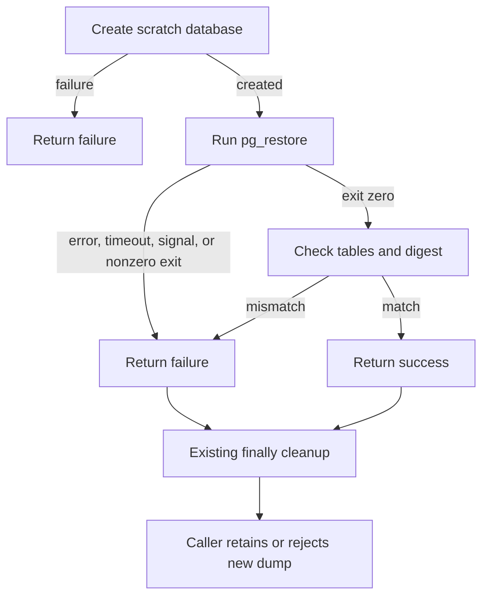

# Database restore command failure slice

Owner: backup repair delegate. Version: 1. Effective: 2026-09-24.
Status: PLAN READY for the bounded local change below; execution results belong
in the parent data-safety review receipt. This supplements that existing packet.
Baseline: independent clone at `05fc32b99`, initially clean; original source is
preserved in that commit. No canonical checkout or production task changes.

## Requirements and acceptance

- R1: `backend/scripts/backup-db.mjs` must reject a nonzero, missing, interrupted,
  or failed `pg_restore` result before reporting a successful restore. Matching
  table counts and a Users digest cannot excuse failed schema objects.
- R2: A successful command must still pass the existing table and content checks.
- R3: Every created scratch database must still reach the existing cleanup path.
- R4: Restore failure diagnostics must not copy stderr, connection strings, row
  content, or process error messages into the log.

## Blueprint, contracts, and applicability

The only runtime change is the command-result check inside `proveRestorable`.
Inputs and `{ ok, detail }` output stay compatible. No restore errors are
intentionally tolerated. Nonzero status, launch error, timeout, or terminating
signal returns `ok: false`; the caller's existing failure path handles retention.
The `finally` cleanup remains authoritative. Counts and digest checks remain
additional evidence after command success. No retry is introduced.

The source diagram is included; no rendered preview is claimed for this slice.
Wireframes, responsive behavior, accessibility, ERD, API migration, permissions
matrix, and storage migration are N/A: this changes a headless command outcome,
with no new data model, surface, or privilege. State/error flow is above; a
separate sequence diagram would duplicate it. Privacy boundary: no new raw
command-output logging. Live restore, scratch reaping policy, row snapshot
consistency, full schema comparison, and offsite durability are outside scope.

## Executable tests and traceability

`node --test scripts/__tests__/backup-db-restore-failure.test.mjs`

The suite evaluates the exact function with injected fake command, count, and
digest functions. It never imports or runs the CLI, reads environment files,
spawns a process, contacts a database, or writes a backup. Resources are ephemeral
in-memory fixtures. Failed restore results deliberately retain matching counts
and digest so the original false-positive path is exercised.

| Requirement | Tests | Observable acceptance |
| --- | --- | --- |
| R1 | T1-T4 | Failed command returns false and skips success checks |
| R2 | T5-T7 | Clean restore passes; table or digest mismatch fails |
| R3 | T1-T8 | Created scratch is dropped; failed creation does not drop |
| R4 | T1-T4 | Failure detail omits synthetic secret-bearing stderr/message |

First run records the intended RED failures against the original implementation;
then add the narrow check and rerun for GREEN. Syntax and diff checks follow.
Mocks prove failure handling, not PostgreSQL restorability. Race/idempotency,
malformed data, performance, and full recovery suites are N/A for this command
result check; timeout/interruption and cleanup are explicitly covered.

## Operations, decisions, and readiness

One slice: plan -> RED tests -> implementation -> GREEN tests -> parent review.
Preserve the existing 15-minute restore timeout; add no command or retry.
Rollback is reverting this narrow patch in the independent clone. Application to
the scheduled production path, commit, push, and live backup execution remain
outside this delegate's work. The parent owns the combined hostile review and
dated archive. No provider consultation or completed final review is claimed.
