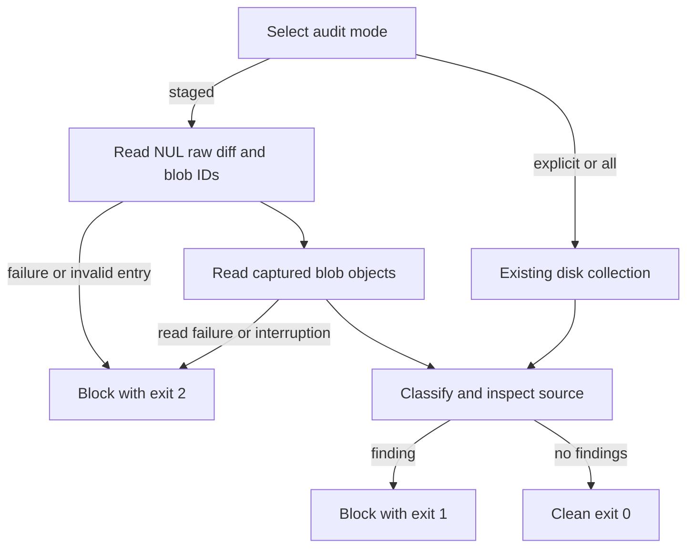

# Staged egress audit input repair

Owner: bounded egress repair delegate. Version 1, 2026-09-24.
Status: PLAN READY for local implementation; parent owns the combined receipt,
review, archive, staging, and publication. This supplements the data-safety packet.
Original tracked source is preserved at `05fc32b99` in the independent clone.

## Contract and requirements

- AEG1: `--staged` audits exact index blob contents, even when disk contents differ
  or the working file is missing. NUL-delimited Git paths preserve Unicode/spacing.
- AEG2: Git enumeration, malformed entries, and missing/unreadable blobs fail closed
  with exit 2. `AI_EGRESS_STAGED_FILES` is not an authoritative input or bypass.
- AEG3: Diagnostics never print source content, command stderr, or raw error text.
- AEG4: Existing explicit/all disk modes and public classification helpers retain
  behavior; clean staged content remains clean despite unstaged hostile edits.
- AEG5: The policy JSON required at module import ships with the code. The pinned
  baseline lacks this file; copy the inspected canonical policy without changes.

Capture changed stage entries using Git raw diff output with NUL paths and full
object IDs. Read each applicable immutable blob by its captured ID. Exclude
deletions, disable rename folding, and fail on entries without a readable blob.
All Git subprocess output is captured. The CLI catches input failures and emits
only a generic diagnostic. No source is printed by findings.

## Tests, traceability, and applicability

`node --test scripts/qa/ai-egress-audit.staged.test.mjs` uses disposable Git
repositories with synthetic text and copied audit/policy files. It runs real Git
and CLI processes, never touches the shared index, invokes hooks, or contacts a
remote. AEG1 covers staged bad/disk good, disk missing, quoted Unicode paths,
renames and staged good/disk bad. AEG2 covers corrupt index, missing blob, and
environment override. AEG3 asserts that the hostile source marker never appears
in stdout/stderr. AEG4 checks explicit/all modes and the existing helper suite.
AEG5 includes a real import test; baseline import failure is dependency evidence,
not behavioral RED. Run staged tests RED before implementation, then GREEN.

Wireframes, responsive/accessibility, ERD, permissions matrix, and migrations are
N/A for this headless input-source correction. The flow above covers state/error
behavior; a separate sequence diagram adds no contract. No rendered diagram is
claimed. File-content trust and diagnostics are the privacy boundaries. Fixture
resources are ephemeral. No runtime provider, network, or production test applies.

One slice: contract -> RED -> source repair -> GREEN -> parent hostile review.
No retries, new dependencies, scheduling changes, or egress-rule rewrites.
Rollback is reverting the narrow patch in the independent clone. This static
ratchet does not certify provider redaction, OS controls, or arbitrary transports.
Performance remains bounded by Git subprocess buffers; oversized input blocks.
The policy remains the existing disk-loaded policy; tamper-proof policy provenance
and new rules are outside scope. Final review and canonical deployment remain
pending with the parent; no provider consultation is claimed here.
