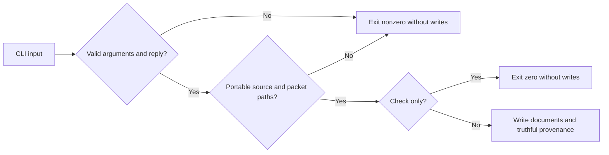

# Splitter provenance repair — A1-15

Owner: delegated Codex builder; 2026-09-24; version 1.
Status: IMPLEMENTATION VERIFIED by local CLI fixtures; parent review/publication pending.
Parent packet: data-safety sweep 2026-09-23, S6; this is its bounded repair note,
not a replacement blueprint. Original archived A1-15 remains unchanged.

## Baseline and scope

Entry point: `scripts/split-astra-blueprint.mjs`, isolated clone branch
`codex/data-safety-repair-20260924`, base `05fc32b99dc4f307d8e3f794857a774fca4b00f6`.
Original splitter is preserved by that commit. It hardcodes `Astra Pro` and
copies caller paths into provenance. Existing CLI suite: 9/9 PASS.
Other agents' dirty files are outside this ownership. No commits or publication.

## Requirements, contracts, and traceability

| Requirement | Observable contract | CLI test |
|---|---|---|
| R1 | Omitted seat is `unreported`; never infer a reviewer from reply content | T1 |
| R2 | `--seat <label>` records the caller-reported label in review header and manifest | T2 |
| R3 | Source and packet use POSIX paths relative to the generated manifest; relocation preserves their meaning; cross-volume paths fail | T3/T4/T8 |
| R4 | Existing no-argument input/output locations remain unchanged | T5 |
| R5 | Missing/blank values, multiline seat labels, and unknown flags fail before writes | T6/T7 |
| R6 | `--check` accepts provenance options and creates no output | T9 |

The seat is a reported label, not verification of the producing model or transport.
Paths resolve using the invocation directory, then are made relative to `--out-dir`.
Different Windows volumes cannot yield a relative path and must fail before writes.
An explicit packet path retains the existing contract: reference only, not existence validation.
Missing inferred packet remains `not filed in this directory`.

## Blueprint, applicability, and operations

One CLI owns argument validation, splitting, and generated files. Add validated seat
metadata and calculate portable paths before creating the output directory; preserve
the existing section parser and required-document lists. No dependencies are added.

Mermaid source is provided; rendered preview is outside this headless slice.
Wireframes, accessibility, responsive UI, database/ERD, API, permissions matrix,
deployment, migration, and performance budgets: N/A — local text-file CLI, no service
or data-store change. Sequence/state diagrams add no information beyond the flow.
Privacy boundary: generated provenance must not require absolute machine paths.
Cancellation and I/O failures retain existing CLI behavior; transactional multi-file
writes and parser redesign are out of scope. Rollback: revert the owned source change.

## Execution and review

1. Add isolated temporary-file CLI acceptance tests, then observe intended RED.
2. Implement provenance/argument changes; run new tests plus the existing CLI suite.
3. Inspect the owned diff, update this evidence, and return to the parent for review,
   archive, and publication. No model/provider calls are authorized for this slice.

Tests create only synthetic temporary fixtures; no repository reply is rewritten.
Native lane orientation returned `not a git repository — no ledger` despite Git
resolving the clone; explicit parent file ownership is recorded. Continuity Bash
could not start in the sandbox (signal pipe Win32 error 5); no continuity edits made.
Independent hostile review remains with the parent; local checks are not that review.

## Evidence receipt

Environment: Windows, Node 24.19.0; all test replies and packets are synthetic.

- Baseline: `node --test scripts/lib/mega-blueprint-splitter.test.mjs` — exit 0,
  9/9 PASS before changes.
- RED: `node --test scripts/__tests__/split-blueprint-provenance.test.mjs` —
  exit 1, 6 expected failures / 1 pass. T1: `manifest must include Reviewer seat`;
  T2: `unknown argument: --seat`; T3: absolute path instead of `../inputs/REPLY.md`;
  T4: `inputs/REPLY.md` instead of `../inputs/REPLY.md`; T5: legacy full location
  instead of manifest-relative `ASTRA-PRO-REPLY.md`; T6: missing-value diagnostic absent.
- Additional RED: `node --test --test-name-pattern='T8:|T9:' scripts/__tests__/split-blueprint-provenance.test.mjs`
  — exit 1, 2 expected failures. T8 accepted a cross-volume packet (actual exit 0);
  T9 rejected `--seat` in check mode (actual exit 1).
- Two sandbox attempts failed with `spawn EPERM` / `spawnSync ... EPERM`; these
  are environment failures, excluded from RED evidence. Authorized runs outside
  the sandbox exercised the actual CLI subprocesses and synthetic temporary files.
- GREEN: `node --test scripts/__tests__/split-blueprint-provenance.test.mjs scripts/lib/mega-blueprint-splitter.test.mjs`
  — exit 0, 18/18 PASS, zero skipped. This includes real generated manifest/header
  assertions, package relocation, 20 missing-value combinations, and no-write checks.
- `node --check` on the splitter and new tests, plus scoped `git diff --check`:
  all exit 0. Only expected Git LF-to-CRLF notices were emitted.

Implementation: 248-line splitter, 144-line new CLI test. Original section/fence
parser and document mandate are unchanged. No source-level regex assertions were
added as proof of generated provenance. Existing 9-test suite remains unchanged.
No model call, commit, push, archive rewrite, or production operation occurred.
Next authorized action: parent reviews the three owned files and includes this
receipt in its data-safety archive/publication decision.
